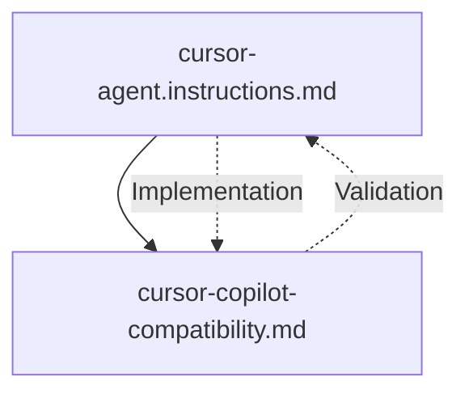

# Cursor Agent Instructions

## Overview

This directory contains comprehensive instructions for the Cursor agent to ensure 100% compatibility with GitHub Copilot. These instructions enable developers to seamlessly switch between VS Code (with GitHub Copilot) and Cursor IDE without any workflow disruption or code inconsistency.

## File Structure

```
docs/cursor-agent/
├── README.md                           # This overview file
├── cursor-agent.instructions.md        # Cursor-specific agent rules and workflows
└── cursor-copilot-compatibility.md     # Detailed compatibility guide with examples
```

## File Purposes

### 1. `cursor-agent.instructions.md`
**Purpose**: Cursor-specific rules and workflows that maintain GitHub Copilot compatibility
**Key Content**:
- Core principles for GitHub Copilot parity
- Memory bank integration requirements
- Code standards and patterns
- Development workflow rules
- IDE-specific considerations
- Compliance verification checklists

**Usage**: This file ensures the Cursor agent follows all memory bank workflows while maintaining exact compatibility with GitHub Copilot.

### 2. `cursor-copilot-compatibility.md`
**Purpose**: Detailed implementation guide with specific examples and validation steps
**Key Content**:
- Specific code generation patterns
- File structure compatibility requirements
- Workflow validation checklists
- Troubleshooting guides for common issues
- Testing and validation procedures
- Maintenance and update processes

**Usage**: This file provides practical implementation details and serves as a reference for maintaining compatibility over time.

## How They Work Together

### 1. Hierarchical Structure


**Implementation Layer** (`cursor-agent.instructions.md`):
- Applies memory bank rules to Cursor context
- Ensures GitHub Copilot compatibility
- Defines Cursor-specific workflows
- Establishes compliance requirements

**Validation Layer** (`cursor-copilot-compatibility.md`):
- Provides specific implementation examples
- Defines validation checklists
- Offers troubleshooting guidance
- Ensures ongoing compatibility

### 2. Workflow Integration

**Cursor Agent Integration**:
1. **Follow Foundation**: Implement all memory bank workflows exactly
2. **Maintain Compatibility**: Ensure identical behavior with GitHub Copilot
3. **Leverage Cursor Features**: Use Cursor capabilities while maintaining patterns
4. **Validate Consistency**: Regular testing across both environments

**Compatibility Validation**:
1. **Cross-IDE Testing**: Test workflows in both VS Code and Cursor
2. **Pattern Validation**: Ensure code generation patterns match exactly
3. **File Operation Testing**: Verify memory bank access works identically
4. **Error Handling Validation**: Confirm error responses are identical

## Key Principles

### 1. 100% Compatibility
- **No Deviation**: All workflows must work identically in both IDEs
- **Pattern Consistency**: Code generation patterns must match exactly
- **Behavior Alignment**: User experience must be seamless across environments

### 2. Memory Bank Compliance
- **Full Integration**: Follow all memory bank workflows without exception
- **Documentation Sync**: Keep all documentation consistent and current
- **Context Preservation**: Maintain complete project context across sessions

### 3. Continuous Validation
- **Regular Testing**: Weekly compatibility checks across both environments
- **Pattern Monitoring**: Identify and resolve any compatibility drift
- **Documentation Updates**: Keep all instructions current and accurate

## Usage Guidelines

### 1. For Cursor Agent
1. **Read All Files**: Start with cursor-agent.instructions.md, then compatibility guide
2. **Follow Workflows**: Implement all memory bank workflows exactly as specified
3. **Maintain Compatibility**: Ensure all patterns match GitHub Copilot exactly
4. **Validate Regularly**: Test compatibility across both environments

### 2. For Developers
1. **Use Either IDE**: Switch between VS Code and Cursor seamlessly
2. **Expect Identical Behavior**: All workflows work the same in both environments
3. **Report Issues**: Notify team of any compatibility problems
4. **Follow Patterns**: Use established patterns for consistency

### 3. For Team Leads
1. **Monitor Compatibility**: Regular validation of cross-IDE functionality
2. **Update Instructions**: Keep all instruction files current and accurate
3. **Train Team**: Ensure all developers understand compatibility requirements
4. **Maintain Standards**: Enforce consistent patterns across the team

## Maintenance Requirements

### 1. Regular Updates
- **Weekly**: Compatibility validation across both IDEs
- **Monthly**: Review and update instruction files
- **Quarterly**: Comprehensive compatibility audit
- **As Needed**: Update when new patterns are discovered

### 2. Quality Standards
- **Accuracy**: All information must be current and correct
- **Completeness**: Cover all aspects comprehensively
- **Clarity**: Use clear, unambiguous language
- **Consistency**: Maintain consistent formatting and structure

### 3. Validation Process
- **Automated Testing**: Scripts for basic compatibility checks
- **Manual Validation**: Human testing of complex workflows
- **Cross-Environment Testing**: Verification in both IDEs
- **Documentation Review**: Regular review of instruction accuracy

## Troubleshooting

### 1. Common Issues
- **Different Code Generation**: Ensure identical prompt patterns
- **File Access Problems**: Verify path handling consistency
- **Task Management Differences**: Check command implementation
- **Memory Bank Inconsistencies**: Validate file structure and content

### 2. Resolution Steps
1. **Identify the Difference**: Compare outputs side by side
2. **Align Implementation**: Make Cursor match GitHub Copilot exactly
3. **Test in Both Environments**: Verify fix resolves the issue
4. **Update Documentation**: Document the resolution

### 3. Prevention Measures
- **Regular Testing**: Weekly compatibility validation
- **Pattern Monitoring**: Continuous observation of behavior
- **Documentation Updates**: Immediate updates when changes occur
- **Team Training**: Ensure all developers understand requirements

## Conclusion

These instruction files work together to create a comprehensive framework for maintaining 100% compatibility between Cursor IDE and GitHub Copilot. The key is following the established memory bank workflows while ensuring all patterns and behaviors remain identical across both development environments.

**Success Criteria**:
- [ ] Developers can switch between IDEs seamlessly
- [ ] All workflows function identically in both environments
- [ ] Memory bank consistency is maintained across sessions
- [ ] Code generation patterns match exactly
- [ ] Task management works identically

**Remember**: Consistency is the foundation of cross-IDE compatibility. Any deviation from established patterns breaks the seamless switching experience.
