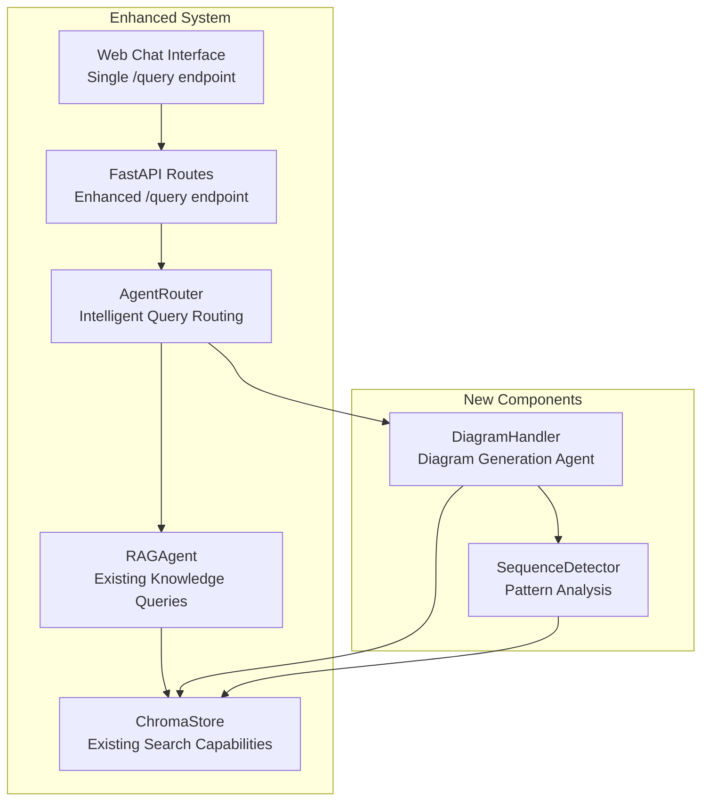

# Multi-Repository Sequence Diagram Implementation Guide (Updated)

## Overview

This implementation guide provides a comprehensive plan for adding multi-repository sequence diagram visualization capabilities to the existing Knowledge Base Agent. The feature will analyze code repositories stored in the vector database to detect and visualize sequence diagrams using Mermaid syntax, displayed through the existing web chat interface.

### Feature Scope

- **Language Support**: Python, JavaScript, TypeScript, C# only
- **Data Source**: Leverage existing indexed repositories in ChromaStore vector database
- **Output Format**: Mermaid sequence diagrams  
- **Interface**: Integration with existing web chat interface
- **Architecture**: Extension of existing RAGAgent and API infrastructure

## Existing Components Analysis

Before implementation, the following existing components have been analyzed and will be leveraged:

### Vector Store Infrastructure
- **ChromaStore**: Complete implementation with `similarity_search()`, `add_documents()`, metadata filtering
- **BaseVectorStore**: Abstract interface already established
- **Metadata Support**: Complex metadata filtering already implemented

### RAG Agent Capabilities  
- **RAGAgent.query()**: Main query processing with retrieval chain
- **RAGAgent.similarity_search()**: Direct vector search without LLM
- **Document Management**: Add/retrieve documents with source tracking

### API Structure
- **FastAPI Framework**: Established with CORS, error handling
- **Existing Models**: QueryRequest, QueryResponse, RepositoryInfo
- **Route Pattern**: `/query`, `/index`, `/health` endpoints established

### Text Processing
- **TextProcessor**: Language-specific chunking with enhanced chunking system
- **ChunkingFactory**: Support for Python, C#, JavaScript/TypeScript parsers

## Implementation Strategy

### Approach: Agent Router Pattern

Instead of modifying the existing `/query` endpoint or creating separate endpoints, this implementation uses an intelligent agent routing pattern:

1. **Single Entry Point**: Web interface continues to use only the `/query` endpoint
2. **AgentRouter**: New router component that analyzes queries and routes to appropriate agents
3. **Specialized Agents**: 
   - **RAGAgent**: Existing agent for knowledge base queries
   - **DiagramHandler**: New specialized agent for diagram generation
4. **Extended Response**: QueryResponse model extended to include optional diagram fields

## Architecture Integration



## User Question Patterns & Expected Responses

Before implementation, it's crucial to define the various ways users might request diagrams and the expected system behavior. This section serves as both a specification for developers and test cases for validation.

### Diagram Request Detection Patterns

#### Direct Diagram Requests
**User Questions:**
- "Show me a sequence diagram for user authentication"
- "Generate a flow diagram for the payment process"
- "Create a sequence diagram for order processing"
- "I want to see the interaction flow for user registration"

**Expected Behavior:**
- **Agent Routing**: Should route to DiagramHandler
- **Response Type**: QueryResponse with `mermaid_code` populated
- **Answer Field**: Analysis summary (e.g., "Analyzed 8 files across 3 repositories, found 12 interactions")
- **Source Documents**: Relevant code files used for diagram generation
- **Mermaid Code**: Valid Mermaid sequence diagram syntax

#### Visualization Requests
**User Questions:**
- "Visualize how the authentication system works"
- "Show me how data flows through the API"
- "Can you map out the user creation process?"
- "Display the interaction between services"

**Expected Behavior:**
- **Agent Routing**: Should route to DiagramHandler
- **Response Focus**: Emphasize visual representation of code interactions
- **Diagram Scope**: Focus on service/component interactions

#### Flow Analysis Requests
**User Questions:**
- "How does the login flow work?"
- "What's the call sequence for processing payments?"
- "Walk me through the user onboarding flow"
- "Explain the API request flow"

**Expected Behavior:**
- **Agent Routing**: Should route to DiagramHandler
- **Response Style**: Include both diagram and explanatory text
- **Diagram Focus**: Step-by-step sequence representation

#### Mermaid-Specific Requests
**User Questions:**
- "Generate mermaid code for the checkout process"
- "Create mermaid diagram for service interactions"
- "Show mermaid sequence for user management"

**Expected Behavior:**
- **Agent Routing**: Should route to DiagramHandler
- **Response Format**: Prioritize clean mermaid syntax
- **Code Quality**: Ensure valid, renderable mermaid code

### Non-Diagram Requests (Should Route to RAGAgent)

#### General Code Questions
**User Questions:**
- "How does the authentication middleware work?"
- "What are the available API endpoints?"
- "Explain the database schema design"
- "Show me the configuration options"

**Expected Behavior:**
- **Agent Routing**: Should route to RAGAgent
- **Response Type**: Standard QueryResponse without mermaid_code
- **Content**: Detailed text explanations with code snippets

#### Documentation Requests
**User Questions:**
- "How do I set up the development environment?"
- "What are the deployment requirements?"
- "List the available configuration settings"

**Expected Behavior:**
- **Agent Routing**: Should route to RAGAgent
- **Response Focus**: Documentation and setup information

### Edge Cases & Error Scenarios

#### Ambiguous Requests
**User Questions:**
- "Tell me about the user flow" (could be diagram or explanation)
- "How are services connected?" (could be architecture or sequence)
- "Show me the API structure" (could be diagram or documentation)

**Expected Behavior:**
- **Agent Routing**: Should have clear decision logic
- **Fallback Strategy**: Default to RAGAgent for ambiguous cases
- **User Guidance**: Response should indicate if diagram is available

#### No Relevant Code Found
**User Questions:**
- "Show sequence diagram for Bitcoin integration" (if no Bitcoin code exists)
- "Generate flow for machine learning pipeline" (if no ML code exists)

**Expected Behavior:**
- **Agent Routing**: Routes to DiagramHandler
- **Response**: Graceful failure message
- **Fallback**: Suggest available diagram topics or route to RAGAgent

### Expected Response Examples

#### Successful Diagram Generation
```json
{
  "answer": "Analyzed 12 files across 4 repositories, found 18 interactions for user authentication flow",
  "source_documents": [
    {
      "content": "class AuthController:\n    def login(self, credentials):\n        user = self.user_service.authenticate(credentials)...",
      "metadata": {
        "file_path": "src/controllers/auth_controller.py",
        "repository": "user-service"
      }
    }
  ],
  "status": "success",
  "num_sources": 12,
  "mermaid_code": "sequenceDiagram\n    participant Client\n    participant AuthController\n    participant UserService\n    participant Database\n    Client->>+AuthController: login(credentials)\n    AuthController->>+UserService: authenticate(credentials)\n    UserService->>+Database: findUser(email)\n    Database-->>-UserService: user\n    UserService-->>-AuthController: authenticated_user\n    AuthController-->>-Client: auth_token",
  "diagram_type": "sequence"
}
```

#### Regular RAG Response
```json
{
  "answer": "The authentication middleware works by intercepting incoming requests and validating JWT tokens...",
  "source_documents": [
    {
      "content": "def authenticate_request(request):\n    token = request.headers.get('Authorization')...",
      "metadata": {
        "file_path": "src/middleware/auth.py",
        "repository": "api-gateway"
      }
    }
  ],
  "status": "success",
  "num_sources": 5,
  "mermaid_code": null,
  "diagram_type": null
}
```

#### Error Response (No Code Found)
```json
{
  "answer": "I couldn't find sufficient code to generate a sequence diagram for blockchain integration. However, I can help you with other available flows in the codebase.",
  "source_documents": [],
  "status": "error",
  "num_sources": 0,
  "error": "Insufficient code patterns found for diagram generation",
  "mermaid_code": null,
  "diagram_type": null
}
```

### Testing Validation Criteria

#### Agent Router Testing
- [ ] **Keyword Detection**: Test all diagram request patterns route to DiagramHandler
- [ ] **Non-Diagram Routing**: Ensure general questions route to RAGAgent
- [ ] **Edge Case Handling**: Verify ambiguous requests have consistent behavior
- [ ] **Case Insensitivity**: Test uppercase/lowercase/mixed case variations

#### Diagram Generation Testing
- [ ] **Valid Mermaid Syntax**: All generated diagrams should render without errors
- [ ] **Participant Naming**: Names should be sanitized for Mermaid compatibility
- [ ] **Interaction Logic**: Sequence should reflect actual code flow
- [ ] **Source Attribution**: All source files should be properly referenced

#### Response Format Testing
- [ ] **Field Consistency**: All responses should follow QueryResponse schema
- [ ] **Error Handling**: Graceful degradation when diagram generation fails
- [ ] **Content Quality**: Analysis summaries should be informative and accurate

## Implementation Plan

### Phase 1: Extend Data Models

Add diagram-specific models to existing API structure:

```python
# Update src/api/models.py to extend QueryResponse

class QueryResponse(BaseModel):
    answer: str
    source_documents: List[Dict[str, Any]]
    status: str
    num_sources: int
    error: Optional[str] = None
    # Extended fields for diagram responses
    mermaid_code: Optional[str] = None
    diagram_type: Optional[str] = None
```

### Phase 2: Create DiagramHandler (Separate Agent)

Create a dedicated diagram generation component that works alongside the RAGAgent:

```python
# Create src/processors/diagram_handler.py

class DiagramHandler:
    """Specialized agent for diagram generation using existing vector store capabilities"""
    
    def __init__(self, vectorstore, llm):
        self.vectorstore = vectorstore
        self.llm = llm
        self.sequence_detector = SequenceDetector()
    
    def generate_sequence_diagram(self, query: str) -> Dict[str, Any]:
        """Generate sequence diagram using existing similarity search"""
        
        # Step 1: Use existing similarity_search to find relevant code
        code_docs = self._find_relevant_code(query)
        
        # Step 2: Analyze patterns using existing metadata
        sequence_patterns = self._analyze_interaction_patterns(code_docs)
        
        # Step 3: Generate Mermaid diagram
        mermaid_code = self._generate_mermaid_sequence(sequence_patterns)
        
        return {
            "analysis_summary": self._create_analysis_summary(sequence_patterns),
            "mermaid_code": mermaid_code,
            "diagram_type": "sequence",
            "source_documents": self._format_source_docs(code_docs),
            "status": "success"
        }
    
    def _find_relevant_code(self, query: str) -> List[Document]:
        """Leverage existing ChromaStore.similarity_search()"""
        # Use existing vector search - no new implementation needed
        results = self.vectorstore.similarity_search(
            query=query,
            k=20  # Get more results for comprehensive analysis
        )
        
        # Filter for supported languages using existing metadata
        supported_languages = {'python', 'javascript', 'typescript', 'csharp'}
        filtered_results = []
        
        for doc in results:
            file_path = doc.metadata.get('file_path', '')
            language = self._detect_language_from_path(file_path)
            if language in supported_languages:
                filtered_results.append(doc)
        
        return filtered_results[:15]  # Limit for processing efficiency
    
    def _analyze_interaction_patterns(self, docs: List[Document]) -> List[Dict]:
        """Analyze code for interaction patterns"""
        patterns = []
        
        for doc in docs:
            language = self._detect_language_from_path(doc.metadata.get('file_path', ''))
            pattern = self.sequence_detector.analyze_code(doc.page_content, language)
            if pattern:
                pattern['source_file'] = doc.metadata.get('file_path', 'unknown')
                pattern['repository'] = doc.metadata.get('repository', 'unknown')
                patterns.append(pattern)
        
        return patterns
    
    def _generate_mermaid_sequence(self, patterns: List[Dict]) -> str:
        """Generate Mermaid sequence diagram code"""
        mermaid_lines = ["sequenceDiagram"]
        participants = set()
        interactions = []
        
        # Extract participants and interactions
        for pattern in patterns:
            if pattern.get('interactions'):
                for interaction in pattern['interactions']:
                    caller = interaction.get('caller', 'Unknown')
                    callee = interaction.get('callee', 'Unknown')
                    method = interaction.get('method', 'unknownMethod')
                    
                    participants.add(caller)
                    participants.add(callee)
                    interactions.append((caller, callee, method))
        
        # Add participants
        for participant in sorted(participants):
            mermaid_lines.append(f"    participant {self._sanitize_name(participant)}")
        
        # Add interactions
        for caller, callee, method in interactions:
            sanitized_caller = self._sanitize_name(caller)
            sanitized_callee = self._sanitize_name(callee)
            mermaid_lines.append(f"    {sanitized_caller}->>+{sanitized_callee}: {method}")
            mermaid_lines.append(f"    {sanitized_callee}-->>-{sanitized_caller}: return")
        
        return "\\n".join(mermaid_lines)
    
    def _detect_language_from_path(self, file_path: str) -> str:
        """Detect language from file extension"""
        ext_map = {
            '.py': 'python',
            '.js': 'javascript', 
            '.ts': 'typescript',
            '.cs': 'csharp'
        }
        for ext, lang in ext_map.items():
            if file_path.endswith(ext):
                return lang
        return 'unknown'
    
    def _sanitize_name(self, name: str) -> str:
        """Sanitize names for Mermaid compatibility"""
        return name.replace(' ', '_').replace('-', '_').replace('.', '_')
    
    def _format_source_docs(self, docs: List[Document]) -> List[Dict]:
        """Format source documents for response"""
        formatted = []
        for doc in docs:
            formatted.append({
                "content": doc.page_content[:300] + "..." if len(doc.page_content) > 300 else doc.page_content,
                "metadata": doc.metadata
            })
        return formatted
    
    def _create_analysis_summary(self, patterns: List[Dict]) -> str:
        """Create human-readable analysis summary"""
        file_count = len(patterns)
        repo_count = len(set(p.get('repository', 'unknown') for p in patterns))
        interaction_count = sum(len(p.get('interactions', [])) for p in patterns)
        
        return f"Analyzed {file_count} files across {repo_count} repositories, found {interaction_count} interactions"
```

### Phase 4: Implement SequenceDetector

Create language-specific pattern detection:

```python
# Create src/processors/sequence_detector.py

class SequenceDetector:
    """Detects interaction patterns in code for sequence diagrams"""
    
    def analyze_code(self, code: str, language: str) -> Dict:
        """Analyze code for interaction patterns based on language"""
        if language == 'python':
            return self._analyze_python_code(code)
        elif language in ['javascript', 'typescript']:
            return self._analyze_js_ts_code(code)
        elif language == 'csharp':
            return self._analyze_csharp_code(code)
        else:
            return {}
    
    def _analyze_python_code(self, code: str) -> Dict:
        """Analyze Python code for method calls and class interactions"""
        try:
            import ast
            tree = ast.parse(code)
            
            interactions = []
            current_class = None
            current_method = None
            
            for node in ast.walk(tree):
                if isinstance(node, ast.ClassDef):
                    current_class = node.name
                elif isinstance(node, ast.FunctionDef):
                    current_method = node.name
                elif isinstance(node, ast.Call):
                    interaction = self._extract_python_call(node, current_class, current_method)
                    if interaction:
                        interactions.append(interaction)
            
            return {
                'language': 'python',
                'interactions': interactions
            }
            
        except SyntaxError:
            return {'language': 'python', 'interactions': []}
    
    def _analyze_js_ts_code(self, code: str) -> Dict:
        """Analyze JavaScript/TypeScript code for function calls"""
        # Simplified regex-based analysis for function calls
        import re
        
        interactions = []
        
        # Find function/method calls
        call_pattern = r'(\w+)\.(\w+)\s*\('
        matches = re.finditer(call_pattern, code)
        
        for match in matches:
            caller = self._extract_context_from_js(code, match.start())
            callee = match.group(1)
            method = match.group(2)
            
            interactions.append({
                'caller': caller or 'Client',
                'callee': callee,
                'method': method
            })
        
        return {
            'language': 'javascript' if '.js' in code else 'typescript',
            'interactions': interactions
        }
    
    def _analyze_csharp_code(self, code: str) -> Dict:
        """Analyze C# code for method calls"""
        import re
        
        interactions = []
        
        # Find method calls
        call_pattern = r'(\w+)\.(\w+)\s*\('
        matches = re.finditer(call_pattern, code)
        
        for match in matches:
            caller = self._extract_context_from_csharp(code, match.start())
            callee = match.group(1)
            method = match.group(2)
            
            interactions.append({
                'caller': caller or 'Client',
                'callee': callee,
                'method': method
            })
        
        return {
            'language': 'csharp',
            'interactions': interactions
        }
    
    def _extract_python_call(self, call_node, current_class, current_method):
        """Extract call information from Python AST node"""
        if hasattr(call_node.func, 'attr') and hasattr(call_node.func, 'value'):
            if hasattr(call_node.func.value, 'id'):
                callee = call_node.func.value.id
                method = call_node.func.attr
                caller = current_class or 'Client'
                
                return {
                    'caller': caller,
                    'callee': callee,
                    'method': method
                }
        return None
    
    def _extract_context_from_js(self, code: str, position: int) -> str:
        """Extract calling context from JavaScript/TypeScript code"""
        # Look backwards for class/function definition
        lines = code[:position].split('\\n')
        for line in reversed(lines[-10:]):  # Check last 10 lines
            if 'class ' in line or 'function ' in line:
                import re
                match = re.search(r'(class|function)\\s+(\\w+)', line)
                if match:
                    return match.group(2)
        return 'Client'
    
    def _extract_context_from_csharp(self, code: str, position: int) -> str:
        """Extract calling context from C# code"""
        # Look backwards for class/method definition
        lines = code[:position].split('\\n')
        for line in reversed(lines[-10:]):  # Check last 10 lines
            if 'class ' in line or 'public ' in line and '(' in line:
                import re
                match = re.search(r'class\\s+(\\w+)|public\\s+\\w+\\s+(\\w+)\\s*\\(', line)
                if match:
                    return match.group(1) or match.group(2)
        return 'Client'
```

### Phase 5: Implement Agent Router

Create an intelligent routing system within the existing `/query` endpoint:

```python
# Create src/agents/agent_router.py

class AgentRouter:
    """Routes queries to appropriate specialized agents with enhanced pattern detection"""
    
    def __init__(self, rag_agent, diagram_handler):
        self.rag_agent = rag_agent
        self.diagram_handler = diagram_handler
        # Pre-compile regex patterns for better performance
        self._diagram_patterns = self._compile_diagram_patterns()
    
    def route_query(self, question: str) -> Dict[str, Any]:
        """Route query to appropriate agent based on content analysis"""
        
        # Detect diagram requests using enhanced pattern matching
        if self._is_diagram_request(question):
            logger.info(f"Routing to diagram generation: {question[:100]}...")
            return self._generate_diagram_response(question)
        
        # Default to RAG agent for regular queries
        logger.info(f"Routing to RAG agent: {question[:100]}...")
        return self.rag_agent.query(question)
    
    def _compile_diagram_patterns(self) -> List[re.Pattern]:
        """Pre-compile regex patterns for diagram detection"""
        import re
        patterns = [
            # Direct diagram requests
            re.compile(r'\b(?:sequence|flow|interaction)\s+diagram\b', re.IGNORECASE),
            re.compile(r'\bgenerate\s+(?:a\s+)?(?:sequence|flow|mermaid)\b', re.IGNORECASE),
            re.compile(r'\bcreate\s+(?:a\s+)?(?:sequence|flow|diagram)\b', re.IGNORECASE),
            re.compile(r'\bshow\s+(?:me\s+)?(?:a\s+)?(?:sequence|flow|diagram)\b', re.IGNORECASE),
            
            # Visualization requests  
            re.compile(r'\bvisuali[sz]e\s+(?:how|the)\b', re.IGNORECASE),
            re.compile(r'\bmap\s+out\s+the\b', re.IGNORECASE),
            re.compile(r'\bdisplay\s+the\s+interaction\b', re.IGNORECASE),
            
            # Flow analysis requests
            re.compile(r'\bhow\s+does\s+.*\s+flow\s+work', re.IGNORECASE),
            re.compile(r'\bwhat.*\s+(?:call\s+)?sequence\b', re.IGNORECASE),
            re.compile(r'\bwalk\s+me\s+through\s+the.*flow\b', re.IGNORECASE),
            
            # Mermaid-specific requests
            re.compile(r'\bmermaid\s+(?:code|diagram|syntax)\b', re.IGNORECASE),
            re.compile(r'\bgenerate\s+mermaid\b', re.IGNORECASE),
        ]
        return patterns
    
    def _is_diagram_request(self, question: str) -> bool:
        """Enhanced diagram request detection using multiple strategies"""
        
        # Strategy 1: Pre-compiled regex patterns
        for pattern in self._diagram_patterns:
            if pattern.search(question):
                return True
        
        # Strategy 2: Keyword combination analysis
        question_lower = question.lower()
        
        # Direct keywords
        direct_keywords = [
            'sequence diagram', 'flow diagram', 'interaction diagram',
            'mermaid', 'visualize', 'diagram', 'sequence', 'flow'
        ]
        
        # Context keywords that strengthen diagram intent
        context_keywords = [
            'show', 'generate', 'create', 'display', 'map out',
            'walk through', 'interaction', 'call', 'process'
        ]
        
        # Flow-related phrases
        flow_phrases = [
            'how does', 'what happens when', 'walk me through',
            'show me how', 'explain the flow', 'interaction between'
        ]
        
        # Check for direct keywords
        has_direct_keyword = any(keyword in question_lower for keyword in direct_keywords)
        
        # Check for flow phrases
        has_flow_phrase = any(phrase in question_lower for phrase in flow_phrases)
        
        # Check for context + visualization intent
        has_context = any(keyword in question_lower for keyword in context_keywords)
        has_visualization_intent = any(word in question_lower for word in [
            'interaction', 'sequence', 'flow', 'process', 'steps'
        ])
        
        # Decision logic
        if has_direct_keyword:
            return True
        if has_flow_phrase and has_visualization_intent:
            return True
        if has_context and has_visualization_intent and 'flow' in question_lower:
            return True
            
        return False
    
    def _generate_diagram_response(self, query: str) -> Dict[str, Any]:
        """Generate diagram and format as standard query response"""
        try:
            # Generate diagram using DiagramHandler
            diagram_result = self.diagram_handler.generate_sequence_diagram(query)
            
            # Format as standard QueryResponse with mermaid_code extension
            return {
                "answer": diagram_result.get("analysis_summary", "Generated sequence diagram"),
                "source_documents": diagram_result.get("source_documents", []),
                "status": "success",
                "num_sources": len(diagram_result.get("source_documents", [])),
                "mermaid_code": diagram_result.get("mermaid_code"),  # Extended field
                "diagram_type": "sequence"  # Extended field
            }
            
        except Exception as e:
            logger.error(f"Diagram generation failed: {str(e)}")
            return {
                "answer": "I encountered an error while generating the diagram. Please try again or ask about available flows in the codebase.",
                "source_documents": [],
                "status": "error",
                "num_sources": 0,
                "error": str(e),
                "mermaid_code": None
            }
```

```python
# Update src/api/routes.py to use AgentRouter

from ..agents.agent_router import AgentRouter
from ..processors.diagram_handler import DiagramHandler

# Initialize components at startup
async def initialize_agents():
    """Initialize all agents and router"""
    global rag_agent, agent_router
    
    # Existing RAG agent initialization...
    rag_agent = RAGAgent(llm=llm, vectorstore=vectorstore)
    
    # Initialize diagram handler
    diagram_handler = DiagramHandler(vectorstore, llm)
    
    # Initialize agent router
    agent_router = AgentRouter(rag_agent, diagram_handler)
    
    logger.info("Agent router initialized successfully")

@app.post("/query", response_model=QueryResponse)
async def query_knowledge_base(request: QueryRequest):
    """Enhanced query endpoint with intelligent agent routing"""
    try:
        logger.info(f"Processing query: {request.question[:100]}...")
        
        # Use agent router to handle all query types
        result = agent_router.route_query(request.question)
        
        return QueryResponse(
            answer=result["answer"],
            source_documents=result["source_documents"],
            status=result["status"],
            num_sources=result["num_sources"],
            error=result.get("error"),
            # Include extended fields if present (for diagram responses)
            **{k: v for k, v in result.items() 
               if k in ["mermaid_code", "diagram_type"]}
        )
        
    except Exception as e:
        logger.error(f"Query processing failed: {str(e)}")
        raise HTTPException(
            status_code=500,
            detail=f"Failed to process query: {str(e)}"
        )
```

### Phase 6: Enhance Web Interface

Update existing web interface to handle diagram responses from the single `/query` endpoint:

```html
<!-- Add to web/index.html -->

<!-- Add Mermaid library -->
<script src="https://unpkg.com/mermaid@10/dist/mermaid.min.js"></script>

<script>
// Initialize Mermaid
mermaid.initialize({ startOnLoad: false });

// Enhanced sendMessage function - uses only /query endpoint
async function sendMessage() {
    const input = document.getElementById('messageInput');
    const message = input.value.trim();
    
    if (!message) return;
    
    // Add user message to chat
    addMessage(message, 'user');
    input.value = '';
    
    try {
        // Always use the single /query endpoint
        // Backend agent router will determine the appropriate response type
        const response = await fetch('/query', {
            method: 'POST',
            headers: {'Content-Type': 'application/json'},
            body: JSON.stringify({
                question: message,
                max_results: 5
            })
        });
        
        if (response.ok) {
            const result = await response.json();
            
            // Check if response contains diagram data
            if (result.mermaid_code) {
                addDiagramMessage(result);
            } else {
                // Regular text response
                addMessage(result.answer, 'assistant', result.source_documents);
            }
        } else {
            addMessage('Sorry, I encountered an error. Please try again.', 'assistant');
        }
    } catch (error) {
        console.error('Query failed:', error);
        addMessage('Sorry, I encountered an error. Please try again.', 'assistant');
    }
}

function addDiagramMessage(result) {
    const chatMessages = document.getElementById('chatMessages');
    const messageDiv = document.createElement('div');
    messageDiv.className = 'message assistant-message';
    
    const diagramId = 'diagram-' + Date.now();
    messageDiv.innerHTML = `
        <div class="message-content">
            <p>${result.answer}</p>
            <div id="${diagramId}" class="mermaid-diagram">${result.mermaid_code}</div>
            <details class="source-info">
                <summary>Source Files (${result.source_documents.length})</summary>
                <ul>
                    ${result.source_documents.map(doc => 
                        `<li><strong>${doc.metadata.file_path}</strong> (${doc.metadata.repository})</li>`
                    ).join('')}
                </ul>
            </details>
        </div>
    `;
    
    chatMessages.appendChild(messageDiv);
    
    // Render the Mermaid diagram
    mermaid.render(diagramId + '-svg', result.mermaid_code).then(({svg}) => {
        document.getElementById(diagramId).innerHTML = svg;
    }).catch(error => {
        console.error('Mermaid rendering failed:', error);
        document.getElementById(diagramId).innerHTML = 'Error rendering diagram';
    });
    
    chatMessages.scrollTop = chatMessages.scrollHeight;
}
</script>

<style>
.mermaid-diagram {
    background: #f9f9f9;
    border: 1px solid #ddd;
    border-radius: 4px;
    padding: 10px;
    margin: 10px 0;
    overflow-x: auto;
}

.source-info {
    margin-top: 10px;
    font-size: 0.9em;
    color: #666;
}

.source-info ul {
    margin: 5px 0;
    padding-left: 20px;
}
</style>
```

## Testing Strategy

### Unit Tests

Create comprehensive tests that validate both routing logic and diagram generation:

```python
# tests/test_agent_router.py

import pytest
from src.agents.agent_router import AgentRouter
from src.agents.rag_agent import RAGAgent
from src.processors.diagram_handler import DiagramHandler

class TestAgentRouter:
    """Test agent routing logic with real user question patterns"""
    
    @pytest.fixture
    def mock_rag_agent(self):
        """Mock RAG agent for testing"""
        class MockRAGAgent:
            def query(self, question):
                return {
                    "answer": "Mock RAG response",
                    "source_documents": [],
                    "status": "success",
                    "num_sources": 0
                }
        return MockRAGAgent()
    
    @pytest.fixture  
    def mock_diagram_handler(self):
        """Mock diagram handler for testing"""
        class MockDiagramHandler:
            def generate_sequence_diagram(self, query):
                return {
                    "analysis_summary": "Mock diagram analysis",
                    "mermaid_code": "sequenceDiagram\\n    A->>B: test",
                    "source_documents": [],
                    "status": "success"
                }
        return MockDiagramHandler()
    
    @pytest.fixture
    def agent_router(self, mock_rag_agent, mock_diagram_handler):
        return AgentRouter(mock_rag_agent, mock_diagram_handler)
    
    def test_direct_diagram_requests(self, agent_router):
        """Test detection of direct diagram requests"""
        diagram_questions = [
            "Show me a sequence diagram for user authentication",
            "Generate a flow diagram for the payment process", 
            "Create a sequence diagram for order processing",
            "I want to see the interaction flow for user registration",
            "SHOW ME A SEQUENCE DIAGRAM",  # Test case insensitivity
            "show me sequence diagram for login"
        ]
        
        for question in diagram_questions:
            result = agent_router.route_query(question)
            assert result.get("mermaid_code") is not None, f"Failed for: {question}"
            assert result.get("diagram_type") == "sequence", f"Failed for: {question}"
    
    def test_visualization_requests(self, agent_router):
        """Test detection of visualization requests"""
        visualization_questions = [
            "Visualize how the authentication system works",
            "Show me how data flows through the API",
            "Can you map out the user creation process?",
            "Display the interaction between services",
            "Visualize the payment flow"
        ]
        
        for question in visualization_questions:
            result = agent_router.route_query(question)
            assert result.get("mermaid_code") is not None, f"Failed for: {question}"
    
    def test_flow_analysis_requests(self, agent_router):
        """Test detection of flow analysis requests"""
        flow_questions = [
            "How does the login flow work?",
            "What's the call sequence for processing payments?", 
            "Walk me through the user onboarding flow",
            "Explain the API request flow",
            "How does the checkout flow work?"
        ]
        
        for question in flow_questions:
            result = agent_router.route_query(question)
            assert result.get("mermaid_code") is not None, f"Failed for: {question}"
    
    def test_mermaid_specific_requests(self, agent_router):
        """Test detection of mermaid-specific requests"""
        mermaid_questions = [
            "Generate mermaid code for the checkout process",
            "Create mermaid diagram for service interactions", 
            "Show mermaid sequence for user management",
            "I need mermaid syntax for the API flow"
        ]
        
        for question in mermaid_questions:
            result = agent_router.route_query(question)
            assert result.get("mermaid_code") is not None, f"Failed for: {question}"
            assert result.get("diagram_type") == "sequence", f"Failed for: {question}"
    
    def test_non_diagram_requests(self, agent_router):
        """Test that non-diagram requests route to RAG agent"""
        rag_questions = [
            "How does the authentication middleware work?",
            "What are the available API endpoints?",
            "Explain the database schema design", 
            "Show me the configuration options",
            "How do I set up the development environment?",
            "What are the deployment requirements?",
            "List the available configuration settings"
        ]
        
        for question in rag_questions:
            result = agent_router.route_query(question)
            assert result.get("mermaid_code") is None, f"Failed for: {question}"
            assert result.get("diagram_type") is None, f"Failed for: {question}"
            assert result["answer"] == "Mock RAG response", f"Failed for: {question}"
    
    def test_edge_cases(self, agent_router):
        """Test ambiguous and edge case requests"""
        edge_cases = [
            ("Tell me about the user flow", True),  # Should route to diagram
            ("How are services connected?", False), # Should route to RAG  
            ("Show me the API structure", False),   # Should route to RAG
            ("What is the flow?", False),           # Too vague, route to RAG
            ("flowchart", False),                   # Not sequence diagram
            ("", False),                            # Empty string
            ("flow", True),                         # Single keyword, borderline
        ]
        
        for question, should_be_diagram in edge_cases:
            result = agent_router.route_query(question)
            if should_be_diagram:
                assert result.get("mermaid_code") is not None, f"Should be diagram: {question}"
            else:
                assert result.get("mermaid_code") is None, f"Should be RAG: {question}"

class TestDiagramGeneration:
    """Test diagram generation using existing vector store"""
    
    @pytest.fixture
    def mock_vectorstore(self):
        """Mock vector store that returns sample code documents"""
        class MockVectorStore:
            def similarity_search(self, query, k=20):
                return [
                    Document(
                        page_content='''
class UserService:
    def create_user(self, data):
        validator.validate(data)
        db.save(user)
        notifier.send_email(user)
                        ''',
                        metadata={
                            'file_path': 'src/services/user_service.py',
                            'repository': 'user-management'
                        }
                    ),
                    Document(
                        page_content='''
class AuthController:
    def login(self, credentials):
        user = user_service.authenticate(credentials)
        return jwt.generate_token(user)
                        ''',
                        metadata={
                            'file_path': 'src/controllers/auth.py', 
                            'repository': 'auth-service'
                        }
                    )
                ]
        return MockVectorStore()
    
    def test_sequence_detection_python(self):
        """Test Python code analysis"""
        python_code = '''
class UserService:
    def create_user(self, data):
        validator.validate(data)
        db.save(user)
        notifier.send_email(user)
'''
        detector = SequenceDetector()
        result = detector.analyze_code(python_code, 'python')
        
        assert result['language'] == 'python'
        assert len(result['interactions']) > 0
        assert any(interaction['method'] == 'validate' for interaction in result['interactions'])
    
    def test_diagram_generation_with_real_patterns(self, mock_vectorstore):
        """Test complete diagram generation workflow"""
        diagram_handler = DiagramHandler(mock_vectorstore, None)
        
        test_queries = [
            "Show sequence diagram for user creation",
            "Generate flow for authentication process",
            "Create mermaid diagram for login flow"
        ]
        
        for query in test_queries:
            result = diagram_handler.generate_sequence_diagram(query)
            
            assert result['status'] == 'success'
            assert result['mermaid_code'] is not None
            assert 'sequenceDiagram' in result['mermaid_code']
            assert len(result['source_documents']) > 0
            assert 'Analyzed' in result['analysis_summary']

### Integration Tests

```python
# tests/test_diagram_api_integration.py

import pytest
from fastapi.testclient import TestClient
from src.api.routes import app

class TestDiagramAPIIntegration:
    """Test complete API integration with real question patterns"""
    
    @pytest.fixture
    def client(self):
        return TestClient(app)
    
    def test_diagram_requests_via_query_endpoint(self, client):
        """Test that diagram requests work through the single /query endpoint"""
        diagram_questions = [
            "Show me a sequence diagram for user authentication",
            "Generate flow diagram for payment processing",
            "Visualize how the login system works",
            "Create mermaid code for the checkout process"
        ]
        
        for question in diagram_questions:
            response = client.post("/query", json={
                "question": question,
                "max_results": 5
            })
            
            assert response.status_code == 200
            data = response.json()
            assert data["status"] == "success"
            assert data.get("mermaid_code") is not None
            assert data.get("diagram_type") == "sequence"
            assert "sequenceDiagram" in data["mermaid_code"]
    
    def test_regular_questions_via_query_endpoint(self, client):
        """Test that regular questions still work normally"""
        regular_questions = [
            "How does authentication work?",
            "What are the API endpoints?",
            "Explain the database schema"
        ]
        
        for question in regular_questions:
            response = client.post("/query", json={
                "question": question,
                "max_results": 5
            })
            
            assert response.status_code == 200
            data = response.json()
            assert data["status"] == "success"
            assert data.get("mermaid_code") is None
            assert data.get("diagram_type") is None
    
    def test_response_format_consistency(self, client):
        """Test that both diagram and regular responses follow QueryResponse format"""
        test_cases = [
            ("Show sequence diagram", True),   # Should have diagram
            ("Explain authentication", False)  # Should not have diagram
        ]
        
        for question, should_have_diagram in test_cases:
            response = client.post("/query", json={
                "question": question,
                "max_results": 5
            })
            
            assert response.status_code == 200
            data = response.json()
            
            # All responses should have these fields
            required_fields = ["answer", "source_documents", "status", "num_sources"]
            for field in required_fields:
                assert field in data
            
            # Diagram-specific fields should be present/absent as expected
            if should_have_diagram:
                assert data.get("mermaid_code") is not None
                assert data.get("diagram_type") is not None
            else:
                assert data.get("mermaid_code") is None

### Performance Tests

```python
# tests/test_diagram_performance.py

import pytest
import time
from src.agents.agent_router import AgentRouter

class TestDiagramPerformance:
    """Test performance requirements for diagram generation"""
    
    def test_routing_decision_speed(self, agent_router):
        """Test that routing decisions are made quickly"""
        test_questions = [
            "Show sequence diagram for authentication",
            "How does the payment system work?",
            "Generate mermaid for user flow"
        ] * 100  # Test with 300 questions
        
        start_time = time.time()
        for question in test_questions:
            agent_router._is_diagram_request(question)
        end_time = time.time()
        
        # Should process 300 questions in under 1 second
        assert (end_time - start_time) < 1.0
    
    def test_diagram_generation_timeout(self, mock_vectorstore):
        """Test that diagram generation completes within acceptable time"""
        diagram_handler = DiagramHandler(mock_vectorstore, None)
        
        start_time = time.time()
        result = diagram_handler.generate_sequence_diagram(
            "Show sequence diagram for complex user workflow"
        )
        end_time = time.time()
        
        # Should complete within 10 seconds
        assert (end_time - start_time) < 10.0
        assert result['status'] == 'success'
```
    
    def test_diagram_request_detection(self, mock_rag_agent):
        """Test detection of diagram requests"""
        test_queries = [
            "show me a sequence diagram",
            "generate flow diagram", 
            "visualize the interaction",
            "regular question about code"
        ]
        
        # Test existing _is_diagram_request method
        pass
    
    def test_sequence_detection_python(self):
        """Test Python code analysis"""
        python_code = '''
class UserService:
    def create_user(self, data):
        validator.validate(data)
        db.save(user)
        notifier.send_email(user)
'''
        detector = SequenceDetector()
        result = detector.analyze_code(python_code, 'python')
        
        assert result['language'] == 'python'
        assert len(result['interactions']) > 0
```

### Integration Tests

```python
# tests/test_diagram_api.py

import pytest
from fastapi.testclient import TestClient
from src.api.routes import app

class TestDiagramAPI:
    """Test diagram API endpoints"""
    
    @pytest.fixture
    def client(self):
        return TestClient(app)
    
    def test_diagram_endpoint(self, client):
        """Test diagram generation endpoint"""
        response = client.post("/diagram", json={
            "query": "show sequence diagram for user creation",
            "diagram_type": "sequence"
        })
        
        assert response.status_code == 200
        data = response.json()
        assert "mermaid_code" in data
        assert data["status"] == "success"
```

## Deployment Strategy

### Development Environment

1. **Extend Existing Setup**: Use current Docker configuration
2. **Add Mermaid Support**: Include Mermaid.js in web interface  
3. **Test with Existing Data**: Use already indexed repositories

### Production Considerations

1. **Performance**: Leverage existing ChromaStore optimizations
2. **Scaling**: Use existing vector search performance patterns
3. **Monitoring**: Extend existing logging infrastructure
4. **Error Handling**: Follow existing error handling patterns

## Success Metrics

1. **Functional Success**:
   - Diagram requests detected correctly (>95% accuracy)
   - Valid Mermaid syntax generated (100% valid)
   - Integration with existing chat interface seamless

2. **Performance Success**:
   - Diagram generation under 10 seconds
   - No degradation of existing query performance
   - Efficient use of existing vector search capabilities

3. **User Experience Success**:
   - Intuitive diagram requests
   - Clear visualization in web interface
   - Helpful source file references

## Implementation Timeline

### Week 1: Foundation
- [ ] Extend QueryResponse model with optional diagram fields
- [ ] Create DiagramHandler as separate agent
- [ ] Implement basic SequenceDetector

### Week 2: Core Logic  
- [ ] Implement AgentRouter with intelligent query routing
- [ ] Complete SequenceDetector for all supported languages
- [ ] Mermaid generation logic and integration with existing ChromaStore

### Week 3: API & UI Integration
- [ ] Update /query endpoint to use AgentRouter
- [ ] Enhance web interface with Mermaid rendering for diagram responses
- [ ] Error handling and validation for both agent types

### Week 4: Testing & Polish
- [ ] Comprehensive testing for both regular and diagram queries
- [ ] Performance optimization of agent routing
- [ ] Documentation and deployment

## Conclusion

This implementation maintains the simplicity of the existing web chat interface while adding powerful diagram generation capabilities:

- **Single Endpoint**: Web interface continues to use only `/query` - no API changes needed
- **Intelligent Routing**: Backend automatically determines appropriate agent based on query content
- **Agent Separation**: Clean separation between knowledge base queries (RAGAgent) and diagram generation (DiagramHandler)
- **Existing Infrastructure**: Leverages ChromaStore.similarity_search(), existing error handling, and logging patterns
- **Extended Response**: QueryResponse model gracefully extended to include optional diagram fields

The agent router pattern ensures that:
- Regular knowledge base queries work exactly as before
- Diagram requests are automatically detected and routed to the specialized DiagramHandler
- The web interface can handle both response types seamlessly
- Future specialized agents can be easily added to the router
