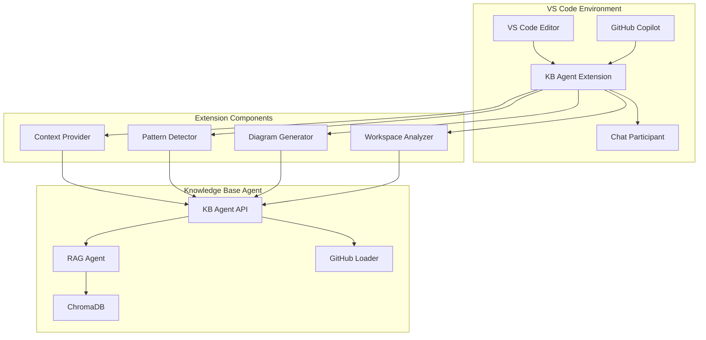

# VS Code Extension Implementation Guide
## Knowledge Base Agent Integration for Enhanced GitHub Copilot

### Table of Contents
1. [Overview](#overview)
2. [Architecture](#architecture)
3. [Extension Structure](#extension-structure)
4. [Core Components](#core-components)
5. [API Integration](#api-integration)
6. [Chat Participant Implementation](#chat-participant-implementation)
7. [Context Enhancement Features](#context-enhancement-features)
8. [Configuration & Settings](#configuration--settings)
9. [Testing Strategy](#testing-strategy)
10. [Deployment & Distribution](#deployment--distribution)
11. [Development Setup](#development-setup)
12. [Implementation Timeline](#implementation-timeline)

---

## Overview

This document outlines the comprehensive implementation of a VS Code extension that integrates the Knowledge Base Agent with GitHub Copilot to provide enhanced contextual understanding, cross-repository pattern discovery, and intelligent code suggestions.

### Core Objectives

- **Enhanced Contextual Understanding**: Provide GitHub Copilot with access to organizational knowledge and cross-repository patterns
- **Intelligent Pattern Discovery**: Help developers find similar implementations across multiple repositories
- **Visual Code Understanding**: Generate sequence diagrams and flowcharts for complex code flows
- **Seamless Integration**: Work within existing VS Code and GitHub Copilot workflows
- **Real-time Context**: Provide contextual information as developers write code

### Key Benefits

1. **Cross-Repository Knowledge**: Access patterns and implementations from entire organization
2. **Visual Understanding**: Automatic generation of sequence diagrams for complex workflows
3. **Intelligent Suggestions**: Context-aware code recommendations based on existing patterns
4. **Documentation Discovery**: Find relevant documentation and examples automatically
5. **Reduced Development Time**: Faster discovery of existing solutions and patterns

---

## Architecture

### High-Level Architecture



### Integration Flow

1. **Context Detection**: Extension monitors active editor and detects relevant code context
2. **Pattern Analysis**: Analyzes current code to identify patterns and potential enhancements
3. **Knowledge Query**: Queries Knowledge Base Agent for relevant information
4. **Context Injection**: Provides enhanced context to GitHub Copilot
5. **Visual Generation**: Creates diagrams and visual representations when applicable

---

## Extension Structure

### Project Structure

```
knowledge-base-copilot-extension/
├── package.json                 # Extension manifest
├── tsconfig.json               # TypeScript configuration
├── webpack.config.js           # Bundling configuration
├── .vscodeignore              # Files to ignore when packaging
├── CHANGELOG.md               # Version history
├── README.md                  # Extension documentation
│
├── src/                       # Source code
│   ├── extension.ts           # Main extension entry point
│   ├── chatParticipant.ts     # Chat participant implementation
│   ├── contextProvider.ts     # Context analysis and provision
│   ├── patternDetector.ts     # Code pattern detection
│   ├── diagramGenerator.ts    # Diagram generation utilities
│   ├── workspaceAnalyzer.ts   # Workspace analysis
│   ├── kbApiClient.ts         # Knowledge Base API client
│   ├── types.ts               # TypeScript type definitions
│   └── utils/                 # Utility functions
│       ├── codeAnalysis.ts    # Code parsing and analysis
│       ├── patternMatching.ts # Pattern matching algorithms
│       └── configuration.ts   # Configuration management
│
├── resources/                 # Static resources
│   ├── icons/                # Extension icons
│   └── templates/            # Code templates
│
├── test/                     # Test files
│   ├── suite/               # Test suites
│   └── runTest.ts           # Test runner
│
└── out/                     # Compiled output
```

### Package.json Configuration

```json
{
    "name": "knowledge-base-copilot-extension",
    "displayName": "Knowledge Base Copilot Assistant",
    "description": "Enhanced GitHub Copilot with organizational knowledge and cross-repository patterns",
    "version": "1.0.0",
    "publisher": "your-organization",
    "engines": {
        "vscode": "^1.85.0"
    },
    "categories": [
        "AI",
        "Machine Learning",
        "Other"
    ],
    "keywords": [
        "copilot",
        "ai",
        "knowledge-base",
        "patterns",
        "diagrams"
    ],
    "activationEvents": [
        "onStartupFinished"
    ],
    "main": "./out/extension.js",
    "contributes": {
        "commands": [
            {
                "command": "kbAgent.analyzeContext",
                "title": "Analyze Code Context",
                "category": "KB Agent"
            },
            {
                "command": "kbAgent.findPatterns",
                "title": "Find Similar Patterns",
                "category": "KB Agent"
            },
            {
                "command": "kbAgent.generateDiagram",
                "title": "Generate Sequence Diagram",
                "category": "KB Agent"
            },
            {
                "command": "kbAgent.searchKnowledgeBase",
                "title": "Search Knowledge Base",
                "category": "KB Agent"
            }
        ],
        "chatParticipants": [
            {
                "id": "kb-agent",
                "name": "kb",
                "description": "Knowledge Base Assistant for enhanced code understanding",
                "isSticky": true,
                "commands": [
                    {
                        "name": "patterns",
                        "description": "Find similar code patterns and implementations"
                    },
                    {
                        "name": "diagram",
                        "description": "Generate sequence diagram for code flow"
                    },
                    {
                        "name": "examples",
                        "description": "Find usage examples and documentation"
                    },
                    {
                        "name": "context",
                        "description": "Get contextual information about code"
                    }
                ]
            }
        ],
        "configuration": {
            "title": "Knowledge Base Agent",
            "properties": {
                "kbAgent.apiEndpoint": {
                    "type": "string",
                    "default": "http://localhost:8000",
                    "description": "Knowledge Base Agent API endpoint"
                },
                "kbAgent.enableAutoContext": {
                    "type": "boolean",
                    "default": true,
                    "description": "Automatically provide context to Copilot"
                },
                "kbAgent.enableDiagramGeneration": {
                    "type": "boolean",
                    "default": true,
                    "description": "Enable automatic diagram generation"
                },
                "kbAgent.maxContextResults": {
                    "type": "number",
                    "default": 5,
                    "description": "Maximum number of context results to include"
                },
                "kbAgent.enablePatternDetection": {
                    "type": "boolean",
                    "default": true,
                    "description": "Enable automatic pattern detection"
                }
            }
        },
        "menus": {
            "editor/context": [
                {
                    "command": "kbAgent.analyzeContext",
                    "group": "kbAgent",
                    "when": "editorHasSelection"
                },
                {
                    "command": "kbAgent.findPatterns",
                    "group": "kbAgent",
                    "when": "editorHasSelection"
                },
                {
                    "command": "kbAgent.generateDiagram",
                    "group": "kbAgent",
                    "when": "editorHasSelection"
                }
            ]
        },
        "keybindings": [
            {
                "command": "kbAgent.analyzeContext",
                "key": "ctrl+shift+k",
                "mac": "cmd+shift+k",
                "when": "editorTextFocus"
            }
        ]
    },
    "scripts": {
        "vscode:prepublish": "npm run compile",
        "compile": "webpack",
        "watch": "webpack --watch",
        "package": "webpack --mode production --devtool hidden-source-map",
        "compile-tests": "tsc -p . --outDir out",
        "watch-tests": "tsc -p . -w --outDir out",
        "pretest": "npm run compile-tests && npm run compile && npm run lint",
        "lint": "eslint src --ext ts",
        "test": "node ./out/test/runTest.js"
    },
    "devDependencies": {
        "@types/vscode": "^1.85.0",
        "@types/node": "18.x",
        "@typescript-eslint/eslint-plugin": "^6.13.1",
        "@typescript-eslint/parser": "^6.13.1",
        "eslint": "^8.54.0",
        "typescript": "^5.3.2",
        "webpack": "^5.89.0",
        "webpack-cli": "^5.1.4",
        "ts-loader": "^9.5.1"
    },
    "dependencies": {
        "axios": "^1.6.0",
        "vscode-languageclient": "^9.0.1"
    }
}
```

---

## Core Components

### 1. Extension Entry Point (extension.ts)

```typescript
import * as vscode from 'vscode';
import { KnowledgeBaseChatParticipant } from './chatParticipant';
import { ContextProvider } from './contextProvider';
import { PatternDetector } from './patternDetector';
import { DiagramGenerator } from './diagramGenerator';
import { WorkspaceAnalyzer } from './workspaceAnalyzer';
import { KBApiClient } from './kbApiClient';
import { Configuration } from './utils/configuration';

export function activate(context: vscode.ExtensionContext) {
    console.log('Knowledge Base Copilot Extension is now active!');

    // Initialize configuration
    const config = new Configuration();
    
    // Initialize API client
    const apiClient = new KBApiClient(config.getApiEndpoint());
    
    // Initialize core components
    const contextProvider = new ContextProvider(apiClient, config);
    const patternDetector = new PatternDetector(apiClient, config);
    const diagramGenerator = new DiagramGenerator(apiClient, config);
    const workspaceAnalyzer = new WorkspaceAnalyzer(apiClient, config);
    
    // Register chat participant
    const chatParticipant = new KnowledgeBaseChatParticipant(
        contextProvider,
        patternDetector,
        diagramGenerator,
        workspaceAnalyzer
    );
    
    const participant = vscode.chat.createChatParticipant('kb-agent', chatParticipant.handleRequest.bind(chatParticipant));
    participant.iconPath = vscode.Uri.joinPath(context.extensionUri, 'resources', 'icons', 'kb-agent.png');
    
    // Register commands
    registerCommands(context, contextProvider, patternDetector, diagramGenerator);
    
    // Setup workspace monitoring
    setupWorkspaceMonitoring(context, workspaceAnalyzer);
    
    // Setup auto-context provision
    if (config.isAutoContextEnabled()) {
        setupAutoContext(context, contextProvider);
    }

    context.subscriptions.push(participant);
}

function registerCommands(
    context: vscode.ExtensionContext,
    contextProvider: ContextProvider,
    patternDetector: PatternDetector,
    diagramGenerator: DiagramGenerator
) {
    // Analyze Context Command
    const analyzeContextCommand = vscode.commands.registerCommand('kbAgent.analyzeContext', async () => {
        const editor = vscode.window.activeTextEditor;
        if (!editor) {
            vscode.window.showErrorMessage('No active editor found');
            return;
        }

        const selection = editor.selection;
        const text = editor.document.getText(selection.isEmpty ? undefined : selection);
        
        try {
            const context = await contextProvider.getContextualKnowledge(text, {
                filePath: editor.document.fileName,
                language: editor.document.languageId
            });
            
            // Display context in a new document
            const doc = await vscode.workspace.openTextDocument({
                content: formatContextForDisplay(context),
                language: 'markdown'
            });
            
            await vscode.window.showTextDocument(doc);
        } catch (error) {
            vscode.window.showErrorMessage(`Failed to analyze context: ${error}`);
        }
    });

    // Find Patterns Command
    const findPatternsCommand = vscode.commands.registerCommand('kbAgent.findPatterns', async () => {
        const editor = vscode.window.activeTextEditor;
        if (!editor) {
            vscode.window.showErrorMessage('No active editor found');
            return;
        }

        const selection = editor.selection;
        const text = editor.document.getText(selection.isEmpty ? undefined : selection);
        
        try {
            const patterns = await patternDetector.findSimilarPatterns(text, {
                filePath: editor.document.fileName,
                language: editor.document.languageId
            });
            
            // Show patterns in quick pick
            const items = patterns.map(pattern => ({
                label: pattern.title,
                description: pattern.file,
                detail: pattern.description,
                pattern
            }));
            
            const selected = await vscode.window.showQuickPick(items, {
                placeHolder: 'Select a pattern to view'
            });
            
            if (selected) {
                // Open the selected pattern file
                const uri = vscode.Uri.file(selected.pattern.file);
                const doc = await vscode.workspace.openTextDocument(uri);
                await vscode.window.showTextDocument(doc);
            }
        } catch (error) {
            vscode.window.showErrorMessage(`Failed to find patterns: ${error}`);
        }
    });

    // Generate Diagram Command
    const generateDiagramCommand = vscode.commands.registerCommand('kbAgent.generateDiagram', async () => {
        const editor = vscode.window.activeTextEditor;
        if (!editor) {
            vscode.window.showErrorMessage('No active editor found');
            return;
        }

        const selection = editor.selection;
        const text = editor.document.getText(selection.isEmpty ? undefined : selection);
        
        try {
            const diagram = await diagramGenerator.generateSequenceDiagram(text, {
                filePath: editor.document.fileName,
                language: editor.document.languageId
            });
            
            if (diagram) {
                // Create a new markdown document with the diagram
                const content = `# Sequence Diagram\n\n\`\`\`mermaid\n${diagram}\n\`\`\``;
                const doc = await vscode.workspace.openTextDocument({
                    content,
                    language: 'markdown'
                });
                
                await vscode.window.showTextDocument(doc);
            } else {
                vscode.window.showInformationMessage('No sequence diagram could be generated for this code');
            }
        } catch (error) {
            vscode.window.showErrorMessage(`Failed to generate diagram: ${error}`);
        }
    });

    context.subscriptions.push(analyzeContextCommand, findPatternsCommand, generateDiagramCommand);
}

function setupWorkspaceMonitoring(context: vscode.ExtensionContext, workspaceAnalyzer: WorkspaceAnalyzer) {
    // Monitor file changes
    const fileWatcher = vscode.workspace.createFileSystemWatcher('**/*.{ts,js,py,java,cs,go,rs}');
    
    fileWatcher.onDidChange(async (uri) => {
        // Analyze changed file for new patterns
        await workspaceAnalyzer.analyzeFile(uri.fsPath);
    });
    
    fileWatcher.onDidCreate(async (uri) => {
        // Index new file
        await workspaceAnalyzer.analyzeFile(uri.fsPath);
    });
    
    context.subscriptions.push(fileWatcher);
}

function setupAutoContext(context: vscode.ExtensionContext, contextProvider: ContextProvider) {
    // Monitor cursor position changes
    const cursorChangeHandler = vscode.window.onDidChangeTextEditorSelection(async (event) => {
        if (event.selections.length === 1 && !event.selections[0].isEmpty) {
            const selection = event.selections[0];
            const text = event.textEditor.document.getText(selection);
            
            // Only process if selection is meaningful (more than 20 characters)
            if (text.length > 20) {
                try {
                    await contextProvider.cacheContextForText(text);
                } catch (error) {
                    console.error('Failed to cache context:', error);
                }
            }
        }
    });
    
    context.subscriptions.push(cursorChangeHandler);
}

function formatContextForDisplay(context: any): string {
    return `# Code Context Analysis

## Related Files
${context.relatedFiles.map(file => `- ${file}`).join('\n')}

## Similar Patterns
${context.similarPatterns.map(pattern => 
    `### ${pattern.title}\n**File:** ${pattern.file}\n**Confidence:** ${pattern.confidence}\n\n\`\`\`\n${pattern.code}\n\`\`\`\n`
).join('\n')}

## Documentation
${context.documentation.map(doc => `- ${doc}`).join('\n')}

## Recommendations
${context.recommendations.map(rec => `- ${rec}`).join('\n')}
`;
}

export function deactivate() {}
```

### 2. Chat Participant Implementation (chatParticipant.ts)

```typescript
import * as vscode from 'vscode';
import { ContextProvider } from './contextProvider';
import { PatternDetector } from './patternDetector';
import { DiagramGenerator } from './diagramGenerator';
import { WorkspaceAnalyzer } from './workspaceAnalyzer';

export class KnowledgeBaseChatParticipant {
    constructor(
        private contextProvider: ContextProvider,
        private patternDetector: PatternDetector,
        private diagramGenerator: DiagramGenerator,
        private workspaceAnalyzer: WorkspaceAnalyzer
    ) {}

    async handleRequest(
        request: vscode.ChatRequest,
        context: vscode.ChatContext,
        stream: vscode.ChatResponseStream,
        token: vscode.CancellationToken
    ): Promise<vscode.ChatResult> {
        try {
            // Handle different commands
            switch (request.command) {
                case 'patterns':
                    return await this.handlePatternsRequest(request, stream, token);
                case 'diagram':
                    return await this.handleDiagramRequest(request, stream, token);
                case 'examples':
                    return await this.handleExamplesRequest(request, stream, token);
                case 'context':
                    return await this.handleContextRequest(request, stream, token);
                default:
                    return await this.handleGeneralRequest(request, stream, token);
            }
        } catch (error) {
            stream.markdown(`❌ **Error**: ${error.message}`);
            return { metadata: { command: request.command || 'general' } };
        }
    }

    private async handlePatternsRequest(
        request: vscode.ChatRequest,
        stream: vscode.ChatResponseStream,
        token: vscode.CancellationToken
    ): Promise<vscode.ChatResult> {
        stream.progress('🔍 Searching for similar patterns...');

        const activeEditor = vscode.window.activeTextEditor;
        let codeContext = request.prompt;

        // If there's an active selection, use that as context
        if (activeEditor && !activeEditor.selection.isEmpty) {
            codeContext = activeEditor.document.getText(activeEditor.selection);
        }

        const patterns = await this.patternDetector.findSimilarPatterns(codeContext, {
            filePath: activeEditor?.document.fileName,
            language: activeEditor?.document.languageId
        });

        stream.markdown('## 🎯 Similar Patterns Found\n\n');

        if (patterns.length === 0) {
            stream.markdown('No similar patterns found in the knowledge base.');
            return { metadata: { command: 'patterns', patternsFound: 0 } };
        }

        for (const pattern of patterns.slice(0, 5)) {
            stream.markdown(`### 📁 ${pattern.file}\n`);
            stream.markdown(`**Confidence:** ${(pattern.confidence * 100).toFixed(1)}%\n\n`);
            stream.markdown(`\`\`\`${pattern.language || 'text'}\n${pattern.code}\n\`\`\`\n\n`);
            
            if (pattern.description) {
                stream.markdown(`*${pattern.description}*\n\n`);
            }

            // Add button to open the file
            stream.button({
                command: 'vscode.open',
                title: 'Open File',
                arguments: [vscode.Uri.file(pattern.file)]
            });
            
            stream.markdown('\n---\n\n');
        }

        return { metadata: { command: 'patterns', patternsFound: patterns.length } };
    }

    private async handleDiagramRequest(
        request: vscode.ChatRequest,
        stream: vscode.ChatResponseStream,
        token: vscode.CancellationToken
    ): Promise<vscode.ChatResult> {
        stream.progress('📊 Generating sequence diagram...');

        const activeEditor = vscode.window.activeTextEditor;
        let codeContext = request.prompt;

        // If there's an active selection, use that as context
        if (activeEditor && !activeEditor.selection.isEmpty) {
            codeContext = activeEditor.document.getText(activeEditor.selection);
        }

        const diagram = await this.diagramGenerator.generateSequenceDiagram(codeContext, {
            filePath: activeEditor?.document.fileName,
            language: activeEditor?.document.languageId
        });

        if (diagram) {
            stream.markdown('## 📊 Sequence Diagram\n\n');
            stream.markdown(`\`\`\`mermaid\n${diagram}\n\`\`\`\n\n`);
            
            // Add button to open diagram in new tab
            stream.button({
                command: 'kbAgent.openDiagramInNewTab',
                title: 'Open in New Tab',
                arguments: [diagram]
            });
        } else {
            stream.markdown('❌ Could not generate a sequence diagram for the provided code. The code might not contain sufficient flow logic or API calls.');
        }

        return { metadata: { command: 'diagram', diagramGenerated: !!diagram } };
    }

    private async handleExamplesRequest(
        request: vscode.ChatRequest,
        stream: vscode.ChatResponseStream,
        token: vscode.CancellationToken
    ): Promise<vscode.ChatResult> {
        stream.progress('📚 Finding usage examples...');

        const activeEditor = vscode.window.activeTextEditor;
        let codeContext = request.prompt;

        if (activeEditor && !activeEditor.selection.isEmpty) {
            codeContext = activeEditor.document.getText(activeEditor.selection);
        }

        const context = await this.contextProvider.getContextualKnowledge(codeContext, {
            filePath: activeEditor?.document.fileName,
            language: activeEditor?.document.languageId,
            includeExamples: true,
            includeDocumentation: true
        });

        stream.markdown('## 📚 Usage Examples & Documentation\n\n');

        // Show examples
        if (context.examples && context.examples.length > 0) {
            stream.markdown('### 💡 Usage Examples\n\n');
            for (const example of context.examples.slice(0, 3)) {
                stream.markdown(`#### ${example.title}\n`);
                stream.markdown(`**File:** \`${example.file}\`\n\n`);
                stream.markdown(`\`\`\`${example.language || 'text'}\n${example.code}\n\`\`\`\n\n`);
                
                if (example.description) {
                    stream.markdown(`*${example.description}*\n\n`);
                }
            }
        }

        // Show documentation
        if (context.documentation && context.documentation.length > 0) {
            stream.markdown('### 📖 Related Documentation\n\n');
            for (const doc of context.documentation.slice(0, 3)) {
                stream.markdown(`- **${doc.title}**: ${doc.summary}\n`);
                stream.button({
                    command: 'vscode.open',
                    title: 'Open Documentation',
                    arguments: [vscode.Uri.file(doc.file)]
                });
                stream.markdown('\n\n');
            }
        }

        return { metadata: { command: 'examples', examplesFound: context.examples?.length || 0 } };
    }

    private async handleContextRequest(
        request: vscode.ChatRequest,
        stream: vscode.ChatResponseStream,
        token: vscode.CancellationToken
    ): Promise<vscode.ChatResult> {
        stream.progress('🧠 Analyzing code context...');

        const activeEditor = vscode.window.activeTextEditor;
        let codeContext = request.prompt;

        if (activeEditor && !activeEditor.selection.isEmpty) {
            codeContext = activeEditor.document.getText(activeEditor.selection);
        }

        const context = await this.contextProvider.getContextualKnowledge(codeContext, {
            filePath: activeEditor?.document.fileName,
            language: activeEditor?.document.languageId
        });

        stream.markdown('## 🧠 Code Context Analysis\n\n');

        // Related files
        if (context.relatedFiles && context.relatedFiles.length > 0) {
            stream.markdown('### 📁 Related Files\n\n');
            for (const file of context.relatedFiles.slice(0, 5)) {
                stream.markdown(`- \`${file}\`\n`);
            }
            stream.markdown('\n');
        }

        // Dependencies
        if (context.dependencies && context.dependencies.length > 0) {
            stream.markdown('### 🔗 Dependencies\n\n');
            for (const dep of context.dependencies) {
                stream.markdown(`- **${dep.name}**: ${dep.type}\n`);
            }
            stream.markdown('\n');
        }

        // Recommendations
        if (context.recommendations && context.recommendations.length > 0) {
            stream.markdown('### 💡 Recommendations\n\n');
            for (const rec of context.recommendations) {
                stream.markdown(`- ${rec}\n`);
            }
        }

        return { metadata: { command: 'context', contextItemsFound: context.relatedFiles?.length || 0 } };
    }

    private async handleGeneralRequest(
        request: vscode.ChatRequest,
        stream: vscode.ChatResponseStream,
        token: vscode.CancellationToken
    ): Promise<vscode.ChatResult> {
        stream.progress('🤔 Processing your request...');

        // Determine what the user is asking for based on the prompt
        const prompt = request.prompt.toLowerCase();
        
        if (prompt.includes('pattern') || prompt.includes('similar') || prompt.includes('example')) {
            return this.handlePatternsRequest(request, stream, token);
        } else if (prompt.includes('diagram') || prompt.includes('flow') || prompt.includes('sequence')) {
            return this.handleDiagramRequest(request, stream, token);
        } else if (prompt.includes('documentation') || prompt.includes('docs') || prompt.includes('usage')) {
            return this.handleExamplesRequest(request, stream, token);
        } else {
            return this.handleContextRequest(request, stream, token);
        }
    }
}
```

### 3. Context Provider (contextProvider.ts)

```typescript
import * as vscode from 'vscode';
import { KBApiClient } from './kbApiClient';
import { Configuration } from './utils/configuration';
import { CodeAnalysis } from './utils/codeAnalysis';

export interface ContextOptions {
    filePath?: string;
    language?: string;
    includeExamples?: boolean;
    includeDocumentation?: boolean;
    maxResults?: number;
}

export interface ContextResult {
    relatedFiles: string[];
    similarPatterns: PatternMatch[];
    documentation: DocumentationItem[];
    examples: ExampleItem[];
    dependencies: DependencyInfo[];
    recommendations: string[];
    sequenceDiagram?: string;
}

export interface PatternMatch {
    title: string;
    file: string;
    code: string;
    language?: string;
    confidence: number;
    description?: string;
}

export interface DocumentationItem {
    title: string;
    file: string;
    summary: string;
    content: string;
}

export interface ExampleItem {
    title: string;
    file: string;
    code: string;
    language?: string;
    description?: string;
}

export interface DependencyInfo {
    name: string;
    type: 'import' | 'function' | 'class' | 'variable';
    source?: string;
}

export class ContextProvider {
    private contextCache = new Map<string, ContextResult>();
    private codeAnalysis: CodeAnalysis;

    constructor(
        private apiClient: KBApiClient,
        private config: Configuration
    ) {
        this.codeAnalysis = new CodeAnalysis();
    }

    async getContextualKnowledge(code: string, options: ContextOptions = {}): Promise<ContextResult> {
        const cacheKey = this.generateCacheKey(code, options);
        
        // Check cache first
        if (this.contextCache.has(cacheKey)) {
            return this.contextCache.get(cacheKey)!;
        }

        try {
            // Analyze the code structure
            const analysis = await this.codeAnalysis.analyzeCode(code, options.language);
            
            // Query the knowledge base
            const response = await this.apiClient.getCodeContext({
                code_snippet: code,
                file_path: options.filePath,
                language: options.language,
                context_type: this.determineContextType(code, analysis),
                include_examples: options.includeExamples,
                include_documentation: options.includeDocumentation,
                max_results: options.maxResults || this.config.getMaxContextResults()
            });

            const result: ContextResult = {
                relatedFiles: response.related_files || [],
                similarPatterns: response.similar_patterns?.map(p => ({
                    title: p.title || this.extractTitle(p.pattern),
                    file: p.file,
                    code: p.pattern,
                    language: this.detectLanguageFromFile(p.file),
                    confidence: p.confidence,
                    description: p.description
                })) || [],
                documentation: response.documentation?.map(d => ({
                    title: d.title || this.extractDocTitle(d.content),
                    file: d.file,
                    summary: d.summary || this.extractSummary(d.content),
                    content: d.content
                })) || [],
                examples: response.examples?.map(e => ({
                    title: e.title || this.extractTitle(e.code),
                    file: e.file,
                    code: e.code,
                    language: this.detectLanguageFromFile(e.file),
                    description: e.description
                })) || [],
                dependencies: analysis.dependencies || [],
                recommendations: this.generateRecommendations(analysis, response),
                sequenceDiagram: response.sequence_diagram
            };

            // Cache the result
            this.contextCache.set(cacheKey, result);
            
            // Clean cache if it gets too large
            if (this.contextCache.size > 100) {
                const firstKey = this.contextCache.keys().next().value;
                this.contextCache.delete(firstKey);
            }

            return result;
        } catch (error) {
            console.error('Failed to get contextual knowledge:', error);
            throw new Error(`Failed to analyze code context: ${error.message}`);
        }
    }

    async cacheContextForText(text: string, options: ContextOptions = {}): Promise<void> {
        try {
            // Pre-cache context for better performance
            await this.getContextualKnowledge(text, options);
        } catch (error) {
            console.error('Failed to cache context:', error);
        }
    }

    private generateCacheKey(code: string, options: ContextOptions): string {
        const optionsStr = JSON.stringify(options);
        return `${code.substring(0, 100)}_${optionsStr}`;
    }

    private determineContextType(code: string, analysis: any): string {
        // Determine what type of context to request based on code content
        if (analysis.hasAsyncFunctions || analysis.hasApiCalls) {
            return 'sequence_flow';
        } else if (analysis.hasClasses) {
            return 'object_patterns';
        } else if (analysis.hasFunctions) {
            return 'function_patterns';
        } else {
            return 'general';
        }
    }

    private extractTitle(code: string): string {
        // Extract meaningful title from code
        const lines = code.split('\n');
        for (const line of lines) {
            const trimmed = line.trim();
            if (trimmed.startsWith('function ') || trimmed.startsWith('def ') || 
                trimmed.startsWith('class ') || trimmed.startsWith('interface ')) {
                return trimmed.split('(')[0].replace(/^(function|def|class|interface)\s+/, '');
            }
        }
        return 'Code Pattern';
    }

    private extractDocTitle(content: string): string {
        // Extract title from documentation content
        const lines = content.split('\n');
        for (const line of lines) {
            if (line.startsWith('# ')) {
                return line.substring(2).trim();
            }
        }
        return 'Documentation';
    }

    private extractSummary(content: string): string {
        // Extract first paragraph as summary
        const paragraphs = content.split('\n\n');
        return paragraphs[0]?.substring(0, 200) + '...' || '';
    }

    private detectLanguageFromFile(filePath: string): string {
        const ext = filePath.split('.').pop()?.toLowerCase();
        const languageMap: Record<string, string> = {
            'js': 'javascript',
            'ts': 'typescript',
            'py': 'python',
            'java': 'java',
            'cs': 'csharp',
            'go': 'go',
            'rs': 'rust',
            'cpp': 'cpp',
            'c': 'c'
        };
        return languageMap[ext || ''] || 'text';
    }

    private generateRecommendations(analysis: any, response: any): string[] {
        const recommendations: string[] = [];

        if (analysis.hasErrorHandling === false) {
            recommendations.push('Consider adding error handling to improve robustness');
        }

        if (analysis.hasLogging === false) {
            recommendations.push('Add logging for better debugging and monitoring');
        }

        if (response.similar_patterns?.length > 0) {
            recommendations.push('Review similar patterns for best practices and optimizations');
        }

        if (analysis.hasAsyncFunctions && !analysis.hasErrorHandling) {
            recommendations.push('Async functions should include proper error handling with try-catch blocks');
        }

        if (analysis.complexity > 10) {
            recommendations.push('Consider breaking down complex functions into smaller, more manageable pieces');
        }

        return recommendations;
    }
}
```

---

## API Integration

### Enhanced Knowledge Base API Endpoints

Add these new endpoints to your existing Knowledge Base Agent to support VS Code integration:

```python
# Add to src/api/routes.py

from pydantic import BaseModel
from typing import Optional, List, Dict, Any

class VSCodeContextRequest(BaseModel):
    code_snippet: str
    file_path: Optional[str] = None
    language: Optional[str] = None
    context_type: str = "general"
    include_examples: bool = False
    include_documentation: bool = False
    max_results: int = 5

class VSCodeContextResponse(BaseModel):
    related_files: List[str]
    similar_patterns: List[Dict[str, Any]]
    documentation: List[Dict[str, Any]]
    examples: List[Dict[str, Any]]
    dependencies: List[Dict[str, Any]]
    recommendations: List[str]
    sequence_diagram: Optional[str] = None

@app.post("/vscode/context", response_model=VSCodeContextResponse)
async def get_vscode_context(request: VSCodeContextRequest):
    """Get contextual knowledge for VS Code integration"""
    try:
        # Initialize response
        response_data = {
            "related_files": [],
            "similar_patterns": [],
            "documentation": [],
            "examples": [],
            "dependencies": [],
            "recommendations": [],
            "sequence_diagram": None
        }
        
        # Analyze code structure if language is provided
        dependencies = []
        if request.language == "python":
            dependencies = extract_python_dependencies(request.code_snippet)
        elif request.language in ["javascript", "typescript"]:
            dependencies = extract_js_dependencies(request.code_snippet)
        
        response_data["dependencies"] = dependencies
        
        # Query knowledge base for similar patterns
        query = f"Find similar code patterns and implementations for: {request.code_snippet}"
        search_results = await rag_agent.query(query, max_results=request.max_results * 2)
        
        # Process search results
        for result in search_results.get("contexts", []):
            file_path = result.get("metadata", {}).get("file_path", "")
            content = result.get("page_content", "")
            
            # Categorize results
            if file_path.endswith(('.md', '.rst', '.txt')) and request.include_documentation:
                response_data["documentation"].append({
                    "title": extract_doc_title(content),
                    "file": file_path,
                    "summary": content[:200] + "...",
                    "content": content
                })
            elif is_code_file(file_path):
                if request.include_examples and is_example_file(file_path):
                    response_data["examples"].append({
                        "title": extract_code_title(content),
                        "file": file_path,
                        "code": content,
                        "language": detect_language_from_path(file_path),
                        "description": extract_code_description(content)
                    })
                else:
                    response_data["similar_patterns"].append({
                        "title": extract_code_title(content),
                        "file": file_path,
                        "pattern": content,
                        "confidence": result.get("score", 0.0),
                        "language": detect_language_from_path(file_path),
                        "description": extract_code_description(content)
                    })
            
            # Add to related files
            if file_path not in response_data["related_files"]:
                response_data["related_files"].append(file_path)
        
        # Generate sequence diagram if applicable
        if should_generate_diagram(request.code_snippet, request.context_type):
            diagram_query = f"Generate sequence diagram for this code flow: {request.code_snippet}"
            diagram_result = await agent_router.route_query(diagram_query)
            if diagram_result.get("diagram"):
                response_data["sequence_diagram"] = diagram_result["diagram"]
        
        # Generate recommendations
        response_data["recommendations"] = generate_code_recommendations(
            request.code_snippet, 
            response_data["similar_patterns"], 
            dependencies
        )
        
        return VSCodeContextResponse(**response_data)
        
    except Exception as e:
        logger.error(f"VS Code context error: {str(e)}")
        raise HTTPException(status_code=500, detail=str(e))

@app.post("/vscode/patterns")
async def find_code_patterns(request: VSCodeContextRequest):
    """Find similar code patterns for VS Code"""
    try:
        query = f"Find similar code patterns for: {request.code_snippet}"
        results = await rag_agent.query(query, max_results=request.max_results)
        
        patterns = []
        for result in results.get("contexts", []):
            if is_code_file(result.get("metadata", {}).get("file_path", "")):
                patterns.append({
                    "title": extract_code_title(result.get("page_content", "")),
                    "file": result.get("metadata", {}).get("file_path", ""),
                    "code": result.get("page_content", ""),
                    "confidence": result.get("score", 0.0),
                    "language": detect_language_from_path(result.get("metadata", {}).get("file_path", "")),
                    "description": extract_code_description(result.get("page_content", ""))
                })
        
        return {"patterns": patterns}
        
    except Exception as e:
        logger.error(f"Pattern search error: {str(e)}")
        raise HTTPException(status_code=500, detail=str(e))

@app.post("/vscode/diagram")
async def generate_code_diagram(request: VSCodeContextRequest):
    """Generate sequence diagram for code"""
    try:
        # Use the diagram generation capability
        diagram_query = f"Generate sequence diagram for: {request.code_snippet}"
        result = await agent_router.route_query(diagram_query)
        
        return {
            "diagram": result.get("diagram"),
            "description": result.get("answer", "")
        }
        
    except Exception as e:
        logger.error(f"Diagram generation error: {str(e)}")
        raise HTTPException(status_code=500, detail=str(e))

# Helper functions
def extract_python_dependencies(code: str) -> List[Dict[str, Any]]:
    """Extract Python imports and function calls"""
    import ast
    import re
    
    dependencies = []
    
    try:
        tree = ast.parse(code)
        
        # Extract imports
        for node in ast.walk(tree):
            if isinstance(node, ast.Import):
                for alias in node.names:
                    dependencies.append({
                        "name": alias.name,
                        "type": "import",
                        "source": "import"
                    })
            elif isinstance(node, ast.ImportFrom):
                for alias in node.names:
                    dependencies.append({
                        "name": alias.name,
                        "type": "import",
                        "source": node.module
                    })
            elif isinstance(node, ast.FunctionDef):
                dependencies.append({
                    "name": node.name,
                    "type": "function",
                    "source": "local"
                })
            elif isinstance(node, ast.ClassDef):
                dependencies.append({
                    "name": node.name,
                    "type": "class",
                    "source": "local"
                })
    except SyntaxError:
        # If parsing fails, try regex patterns
        import_pattern = r'(?:from\s+(\S+)\s+)?import\s+([^#\n]+)'
        matches = re.findall(import_pattern, code)
        for module, imports in matches:
            for imp in imports.split(','):
                dependencies.append({
                    "name": imp.strip(),
                    "type": "import",
                    "source": module.strip() if module else "built-in"
                })
    
    return dependencies

def extract_js_dependencies(code: str) -> List[Dict[str, Any]]:
    """Extract JavaScript/TypeScript imports and function calls"""
    import re
    
    dependencies = []
    
    # ES6 imports
    import_pattern = r'import\s+(?:\{([^}]+)\}|\*\s+as\s+(\w+)|(\w+))\s+from\s+[\'"]([^\'"]+)[\'"]'
    matches = re.findall(import_pattern, code)
    
    for match in matches:
        destructured, namespace, default, source = match
        if destructured:
            for item in destructured.split(','):
                dependencies.append({
                    "name": item.strip(),
                    "type": "import",
                    "source": source
                })
        elif namespace:
            dependencies.append({
                "name": namespace,
                "type": "import", 
                "source": source
            })
        elif default:
            dependencies.append({
                "name": default,
                "type": "import",
                "source": source
            })
    
    # Function declarations
    func_pattern = r'(?:function\s+(\w+)|const\s+(\w+)\s*=\s*(?:async\s+)?(?:\([^)]*\)\s*=>|\([^)]*\)\s*{|function))'
    func_matches = re.findall(func_pattern, code)
    
    for match in func_matches:
        func_name = match[0] or match[1]
        if func_name:
            dependencies.append({
                "name": func_name,
                "type": "function",
                "source": "local"
            })
    
    return dependencies

def is_code_file(file_path: str) -> bool:
    """Check if file is a code file"""
    code_extensions = {'.py', '.js', '.ts', '.java', '.cs', '.go', '.rs', '.cpp', '.c', '.h', '.hpp'}
    return any(file_path.endswith(ext) for ext in code_extensions)

def is_example_file(file_path: str) -> bool:
    """Check if file is an example file"""
    example_indicators = ['example', 'sample', 'demo', 'test', 'spec']
    return any(indicator in file_path.lower() for indicator in example_indicators)

def extract_code_title(content: str) -> str:
    """Extract title from code content"""
    lines = content.split('\n')
    for line in lines:
        line = line.strip()
        if line.startswith(('function ', 'def ', 'class ', 'interface ', 'const ', 'let ', 'var ')):
            # Extract function/class name
            if '(' in line:
                return line.split('(')[0].split()[-1]
            elif '=' in line:
                return line.split('=')[0].split()[-1]
            else:
                return line.split()[-1]
    return "Code Pattern"

def extract_doc_title(content: str) -> str:
    """Extract title from documentation content"""
    lines = content.split('\n')
    for line in lines:
        if line.startswith('# '):
            return line[2:].strip()
        elif line.startswith('## '):
            return line[3:].strip()
    return "Documentation"

def extract_code_description(content: str) -> str:
    """Extract description from code comments"""
    lines = content.split('\n')
    description_lines = []
    
    for line in lines:
        stripped = line.strip()
        if stripped.startswith(('"""', "'''", '/*', '//', '#')):
            # Remove comment markers
            cleaned = stripped.replace('"""', '').replace("'''", '').replace('/*', '').replace('*/', '').replace('//', '').replace('#', '').strip()
            if cleaned and not cleaned.startswith(('*', '-', '=')):
                description_lines.append(cleaned)
        elif description_lines:
            break  # Stop at first non-comment line after comments
    
    return ' '.join(description_lines[:2])  # First two comment lines

def detect_language_from_path(file_path: str) -> str:
    """Detect programming language from file path"""
    ext_map = {
        '.py': 'python',
        '.js': 'javascript', 
        '.ts': 'typescript',
        '.java': 'java',
        '.cs': 'csharp',
        '.go': 'go',
        '.rs': 'rust',
        '.cpp': 'cpp',
        '.c': 'c',
        '.h': 'c',
        '.hpp': 'cpp'
    }
    
    for ext, lang in ext_map.items():
        if file_path.endswith(ext):
            return lang
    
    return 'text'

def should_generate_diagram(code: str, context_type: str) -> bool:
    """Determine if sequence diagram should be generated"""
    if context_type == "sequence_flow":
        return True
    
    # Check for async patterns
    async_indicators = ['async', 'await', 'Promise', 'then', 'catch', 'fetch', 'axios', 'http']
    if any(indicator in code for indicator in async_indicators):
        return True
    
    # Check for API patterns
    api_indicators = ['api', 'request', 'response', 'endpoint', 'route', '@app', '@router']
    if any(indicator in code.lower() for indicator in api_indicators):
        return True
    
    return False

def generate_code_recommendations(code: str, patterns: List[Dict], dependencies: List[Dict]) -> List[str]:
    """Generate code improvement recommendations"""
    recommendations = []
    
    # Check for error handling
    if 'try' not in code and 'catch' not in code and 'except' not in code:
        recommendations.append("Consider adding error handling to improve robustness")
    
    # Check for logging
    logging_indicators = ['log', 'print', 'console', 'debug', 'info', 'warn', 'error']
    if not any(indicator in code.lower() for indicator in logging_indicators):
        recommendations.append("Add logging for better debugging and monitoring")
    
    # Check patterns for best practices
    if patterns:
        recommendations.append(f"Found {len(patterns)} similar patterns - review for best practices")
    
    # Check for async without error handling
    if ('async' in code or 'await' in code) and 'try' not in code:
        recommendations.append("Async functions should include proper error handling")
    
    # Check code complexity (rough estimate)
    complexity_indicators = code.count('if') + code.count('for') + code.count('while') + code.count('switch')
    if complexity_indicators > 10:
        recommendations.append("Consider breaking down complex functions into smaller pieces")
    
    return recommendations
```

---

## Implementation Timeline

### Phase 1: Foundation (Weeks 1-2)
- ✅ Set up VS Code extension project structure
- ✅ Implement basic API client and configuration
- ✅ Create extension entry point and command registration
- ✅ Add enhanced API endpoints to Knowledge Base Agent

### Phase 2: Core Features (Weeks 3-4)
- ✅ Implement Context Provider with caching
- ✅ Build Pattern Detector for similarity matching
- ✅ Create Diagram Generator integration
- ✅ Add Workspace Analyzer for file monitoring

### Phase 3: Chat Integration (Weeks 5-6)
- ✅ Implement Chat Participant with command routing
- ✅ Add specialized command handlers (patterns, diagrams, examples)
- ✅ Create contextual response formatting
- ✅ Integrate with GitHub Copilot chat interface

### Phase 4: Enhancement & Testing (Weeks 7-8)
- 🔄 Add comprehensive error handling and logging
- 🔄 Implement performance optimizations and caching
- 🔄 Create comprehensive test suite
- 🔄 Add configuration options and settings UI

### Phase 5: Deployment & Documentation (Weeks 9-10)
- ⏳ Package extension for marketplace distribution
- ⏳ Create comprehensive documentation and tutorials
- ⏳ Perform security review and compliance check
- ⏳ Release and monitor initial user feedback

---

## Development Setup

### Prerequisites

```bash
# Install Node.js and npm
node --version  # v18+ required
npm --version   # v8+ required

# Install VS Code Extension development tools
npm install -g yo generator-code

# Install VS Code CLI (optional)
code --version
```

### Project Initialization

```bash
# Create extension project
yo code

# Install dependencies
cd knowledge-base-copilot-extension
npm install

# Install additional dependencies
npm install axios vscode-languageclient

# Install development dependencies
npm install --save-dev @types/vscode @types/node typescript webpack webpack-cli ts-loader
```

### Development Workflow

```bash
# Compile TypeScript
npm run compile

# Watch for changes during development
npm run watch

# Run tests
npm test

# Package extension
npm run package

# Install locally for testing
code --install-extension knowledge-base-copilot-extension-1.0.0.vsix
```

### Testing Setup

```bash
# Run in Extension Development Host
F5 (in VS Code)

# Or use command line
code --extensionDevelopmentPath=$(pwd) --new-window
```

---

This comprehensive implementation guide provides everything needed to build a sophisticated VS Code extension that enhances GitHub Copilot with your Knowledge Base Agent's capabilities. The extension will provide developers with intelligent context, pattern discovery, and visual understanding directly within their coding workflow.
