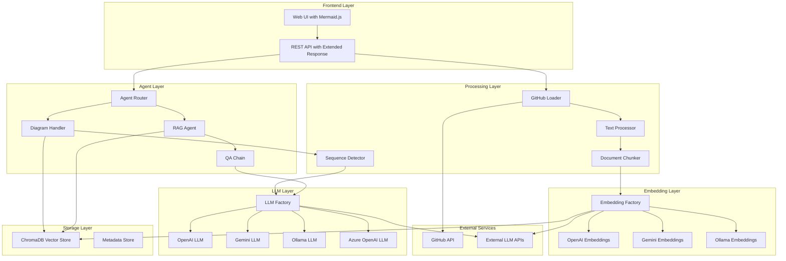
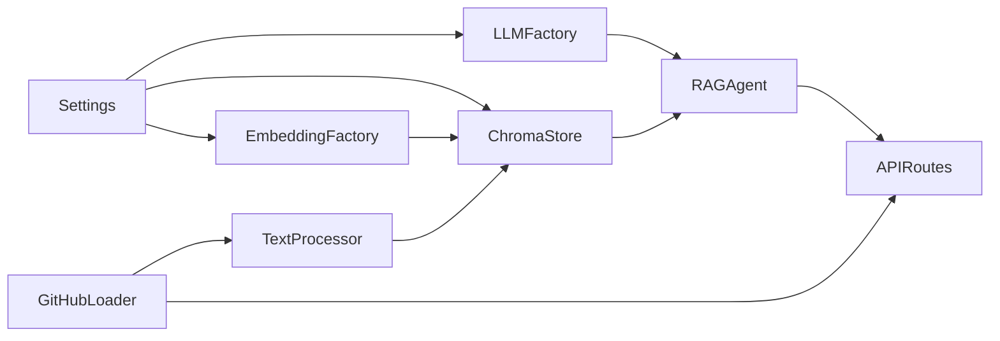

# System Patterns: Knowledge Base Agent

## Architecture Overview

The Knowledge Base Agent follows a **modular RAG (Retrieval-Augmented Generation) architecture with intelligent agent routing** for dual-mode responses (text and visual). The system features clear separation of concerns, pluggable components, and intelligent query routing between specialized agents. The architecture is designed for flexibility, scalability, and maintainability while supporting both traditional text responses and visual code analysis.



## Core Design Patterns

### 1. Agent Router Pattern for Dual-Mode Responses

The system uses an intelligent agent router to automatically detect user intent and route queries to appropriate specialized agents, enabling both text and visual responses from a single endpoint.

**Agent Router Pattern:**
```python
# Router intelligently classifies queries and routes to appropriate agents
def route_query(self, question: str) -> Dict[str, Any]:
    if self._is_diagram_request(question):
        return self.diagram_handler.generate_sequence_diagram(question)
    else:
        return self.rag_agent.query(question)
```

**Key Benefits:**
- **Seamless User Experience**: Single endpoint for all query types
- **Intelligent Classification**: 12+ regex patterns detect diagram requests vs text queries
- **Backward Compatibility**: Existing queries work exactly as before
- **Extensible**: Easy to add new specialized agents for different response types

### 2. Factory Pattern for LLM Abstraction

The system uses factory patterns to abstract LLM and embedding model selection, allowing runtime switching between providers without code changes.

**LLM Factory Pattern:**
```python
# Factory handles provider selection based on configuration
llm = LLMFactory.create_llm(
    provider=settings.llm_provider,
    model=settings.llm_model,
    **config_params
)
```

**Key Benefits:**
- **Provider Agnostic**: Same interface for all LLM providers
- **Runtime Switching**: Change models via configuration without code changes
- **Fallback Support**: Graceful degradation when primary models fail
- **Cost Optimization**: Automatically select cost-effective models for simple queries

### 3. Repository-Based Data Loading

GitHub repositories are processed using a specialized loader that understands code structure and preserves important metadata.

**Loading Pipeline:**
```python
# Multi-stage loading with metadata preservation
documents = GitHubLoader.load_repository(
    repo_url=repo_url,
    file_filters=code_file_patterns,
    preserve_structure=True
)

# Text processing with code-aware chunking
processed_docs = TextProcessor.process_documents(
    documents=documents,
    chunk_strategy="code_aware",
    preserve_imports=True
)
```

**Metadata Schema:**
- `repository`: Repository URL
- `file_path`: Full file path within repository
- `file_type`: Programming language/file type
- `chunk_index`: Position within file for reconstruction
- `commit_sha`: Git commit reference for version tracking

### 4. Vector Store Abstraction

The vector store layer provides a consistent interface while supporting different backends and handling dimension compatibility automatically.

**Vector Store Pattern:**
```python
# Automatic dimension checking and migration
vector_store = ChromaStore(
    collection_name=collection_name,
    embedding_function=embedding_function,
    auto_migrate_dimensions=True
)

# Handles dimension mismatches gracefully
results = vector_store.similarity_search(
    query=user_question,
    k=retrieval_count,
    filter=repository_filter
)
```

### 5. Chain-of-Thought RAG Processing

The RAG agent uses a structured approach to query processing that mirrors human problem-solving patterns.

**RAG Chain Pattern:**
```python
# Structured query processing with context building
def process_query(self, question: str) -> Dict[str, Any]:
    # 1. Query understanding and context extraction
    context = self._extract_query_context(question)
    
    # 2. Relevant document retrieval with filtering
    documents = self._retrieve_relevant_docs(question, context)
    
    # 3. Context assembly with source tracking
    formatted_context = self._assemble_context(documents)
    
    # 4. LLM reasoning with structured prompt
    response = self._generate_response(question, formatted_context)
    
    # 5. Response post-processing and source attribution
    return self._format_response_with_sources(response, documents)
```

## Key Architectural Decisions

### 1. Stateless API Design

**Decision**: REST API with stateless request/response pattern
**Rationale**: Enables horizontal scaling and simplifies deployment
**Implementation**: 
- No session state stored on server
- All context passed in request parameters
- Conversation history managed client-side

### 2. Pluggable LLM Architecture

**Decision**: Factory pattern with provider abstraction
**Rationale**: Avoid vendor lock-in and enable cost optimization
**Implementation**:
- Common interface for all LLM providers
- Configuration-driven provider selection
- Automatic fallback and retry logic

### 3. Code-Aware Text Processing

**Decision**: Specialized chunking for code files
**Rationale**: Preserve semantic meaning of code structures
**Implementation**:
- Language-specific parsing and chunking
- Import/dependency preservation
- Function and class boundary awareness

### 4. Persistent Vector Storage

**Decision**: ChromaDB with Docker volume persistence
**Rationale**: Fast startup without re-indexing, data safety
**Implementation**:
- Automatic persistence verification
- Dimension compatibility checking
- Incremental updates for changed repositories

### 5. Multi-Model Embedding Strategy

**Decision**: Support multiple embedding providers with automatic migration
**Rationale**: Optimize for different use cases and costs
**Implementation**:
- Dimension compatibility validation
- Automatic collection migration when needed
- Performance benchmarking across models

## Component Relationships

### Core Dependencies


### Data Flow Patterns

**Indexing Flow:**
1. API receives repository indexing request
2. GitHubLoader clones/fetches repository content
3. TextProcessor chunks documents with code awareness
4. EmbeddingFactory generates vector embeddings
5. ChromaStore persists embeddings with metadata
6. API returns indexing completion status

**Query Flow:**
1. API receives user question
2. RAGAgent retrieves relevant document chunks
3. LLMFactory generates response using retrieved context
4. RAGAgent formats response with source attribution
5. API returns structured response with sources

### Error Handling Patterns

**Graceful Degradation:**
- LLM provider failures fall back to alternative providers
- Embedding model failures use cached or alternative embeddings
- Vector store connection issues use read-only mode when possible

**User-Friendly Error Messages:**
- Configuration errors include specific setup guidance
- API errors provide actionable troubleshooting steps
- Model compatibility issues suggest automatic fixes

## Performance Patterns

### 1. Lazy Loading and Caching

**Pattern**: Load expensive resources only when needed and cache aggressively
**Implementation**:
- LLM models initialized on first use
- Embedding functions cached after first creation
- Vector store connections pooled and reused

### 2. Asynchronous Processing

**Pattern**: Use background tasks for long-running operations
**Implementation**:
- Repository indexing runs in background tasks
- Multiple repositories can be indexed concurrently
- Progress tracking via API status endpoints

### 3. Efficient Chunking and Retrieval

**Pattern**: Optimize chunk size and retrieval strategy for code content
**Implementation**:
- Code-aware chunking preserves function/class boundaries
- Configurable chunk overlap for context preservation
- Smart retrieval count based on query complexity

## Security Patterns

### 1. API Key Management

**Pattern**: Secure handling of multiple API providers
**Implementation**:
- Environment variable configuration only
- No API keys logged or exposed in responses
- Optional API key rotation support

### 2. GitHub Access Control

**Pattern**: Respect repository access permissions
**Implementation**:
- User-provided GitHub tokens for private repositories
- No persistent storage of GitHub credentials
- Repository access validation before indexing

### 3. Input Validation and Sanitization

**Pattern**: Validate all user inputs and sanitize for LLM processing
**Implementation**:
- Pydantic models for request validation
- Query sanitization to prevent prompt injection
- File type filtering for safe document processing

## Monitoring and Observability Patterns

### 1. Structured Logging

**Pattern**: Comprehensive logging with structured data
**Implementation**:
- JSON-formatted logs for easy parsing
- Request tracing across components
- Performance metrics and timing data

### 2. Health Checks and Status Monitoring

**Pattern**: Multi-level health checking for dependencies
**Implementation**:
- API health endpoints for external monitoring
- Component-level health checks (LLM, vector store, etc.)
- Dependency status validation

### 3. Configuration Visibility

**Pattern**: Runtime configuration inspection and validation
**Implementation**:
- Configuration summary endpoints
- Model compatibility status reporting
- Performance and cost tracking per provider
