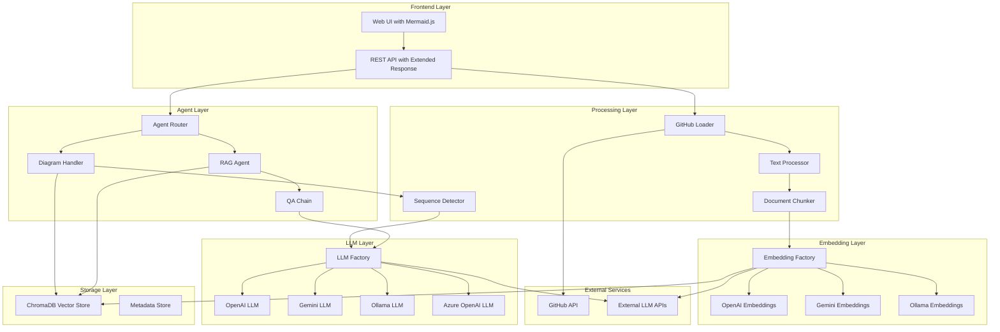
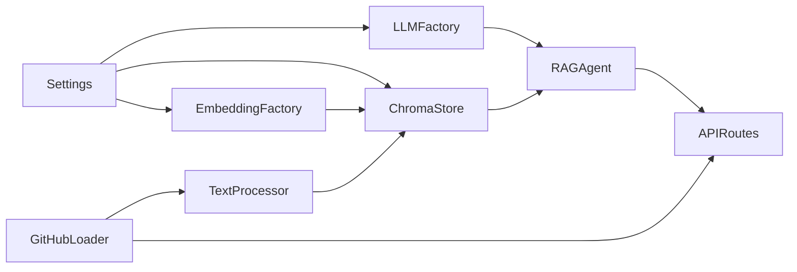

# System Patterns: Knowledge Base Agent

## Architecture Overview

The Knowledge Base Agent follows a **modular RAG (Retrieval-Augmented Generation) architecture with intelligent agent routing** for dual-mode responses (text and visual). The system features clear separation of concerns, pluggable components, and intelligent query routing between specialized agents. The architecture is designed for flexibility, scalability, and maintainability while supporting both traditional text responses and visual code analysis.



## Core Design Patterns

### 1. Agent Router Pattern for Dual-Mode Responses ✅ IMPLEMENTED

The system uses an intelligent agent router to automatically detect user intent and route queries to appropriate specialized agents, enabling both text and visual responses from a single endpoint.

**Agent Router Pattern:**
```python
# Router intelligently classifies queries and routes to appropriate agents
def route_query(self, question: str) -> Dict[str, Any]:
    if self._is_diagram_request(question):
        return self.diagram_handler.generate_sequence_diagram(question)
    else:
        return self.rag_agent.query(question)
```

**Key Benefits:**
- **Seamless User Experience**: Single endpoint for all query types
- **Intelligent Classification**: 12+ regex patterns detect diagram requests vs text queries
- **Extensible Architecture**: Easy to add new agent types and capabilities
- **Advanced RAG Integration**: Supports enhanced reasoning and response quality

### 2. Advanced RAG Agent Pattern ✅ IMPLEMENTED (ENHANCED)

The RAG agent has been significantly enhanced with Chain-of-Thought reasoning, ReAct capabilities, query optimization, and response quality assessment.

**Enhanced RAG Architecture:**
```python
# Advanced RAG with multi-phase processing
class RAGAgent:
    def query(self, question: str) -> Dict[str, Any]:
        # Phase 1: Query Analysis and Optimization
        analyzed_query = self.query_optimizer.analyze_query(question)
        
        # Phase 2: Chain-of-Thought Reasoning
        reasoning_steps = self.reasoning_chain.process(analyzed_query)
        
        # Phase 3: ReAct Agent Processing
        react_result = self.react_agent.process_with_tools(reasoning_steps)
        
        # Phase 4: Response Quality Enhancement
        enhanced_response = self.response_enhancer.improve_response(react_result)
        
        return enhanced_response
```

**Advanced Capabilities:**
- **Chain-of-Thought Reasoning**: Multi-step logical reasoning for complex queries
- **ReAct Agent Integration**: Tool usage and action planning capabilities
- **Query Optimization**: Semantic analysis and query refinement
- **Response Quality Assessment**: Fact-checking, consistency validation, and enhancement
- **Interactive Elements**: Dynamic response components and user engagement features
- **Backward Compatibility**: Existing queries work exactly as before
- **Extensible**: Easy to add new specialized agents for different response types
- **Production Ready**: Successfully deployed and operational

**Implementation Status**: ✅ **COMPLETED AND INTEGRATED** - Fully operational in production

### 2. Factory Pattern for LLM Abstraction ✅ IMPLEMENTED

The system uses factory patterns to abstract LLM and embedding model selection, allowing runtime switching between providers without code changes.

**LLM Factory Pattern:**
```python
# Factory handles provider selection based on configuration
llm = LLMFactory.create_llm(
    provider=settings.llm_provider,
    model=settings.llm_model,
    **config_params
)
```

**Key Benefits:**
- **Provider Agnostic**: Same interface for all LLM providers
- **Runtime Switching**: Change models via configuration without code changes
- **Fallback Support**: Graceful degradation when primary models fail
- **Cost Optimization**: Automatically select cost-effective models for simple queries
- **Enhanced Validation**: Improved configuration validation and error reporting

**Implementation Status**: ✅ **COMPLETED AND ENHANCED** - Enhanced with better error handling

### 3. Repository-Based Data Loading ✅ IMPLEMENTED

GitHub repositories are processed using a specialized loader that understands code structure and preserves important metadata.

**Loading Pipeline:**
```python
# Multi-stage loading with metadata preservation
documents = GitHubLoader.load_repository(
    repo_url=repo_url,
    file_filters=code_file_patterns,
    preserve_structure=True
)

# Text processing with code-aware chunking
processed_docs = TextProcessor.process_documents(
    documents=documents,
    chunk_strategy="code_aware",
    preserve_imports=True
)
```

**Metadata Schema:**
- `repository`: Repository URL
- `file_path`: Full file path within repository
- `file_type`: Programming language/file type
- `chunk_index`: Position within file for reconstruction
- `commit_sha`: Git commit reference for versioning
- `original_file_count`: Count of original files (enhanced tracking)

**Implementation Status**: ✅ **COMPLETED AND ENHANCED** - Improved document tracking and metadata management

### 4. Vector Store Abstraction ✅ IMPLEMENTED

The vector store layer provides a consistent interface while supporting different backends and handling dimension compatibility automatically.

**Vector Store Pattern:**
```python
# Automatic dimension checking and migration
vector_store = ChromaStore(
    collection_name=collection_name,
    embedding_function=embedding_function,
    auto_migrate_dimensions=True
)

# Handles dimension mismatches gracefully
results = vector_store.similarity_search(
    query=user_question,
    k=retrieval_count,
    filter=repository_filter
)
```

**Implementation Status**: ✅ **COMPLETED AND ENHANCED** - Enhanced error handling and metadata management

### 5. Basic RAG Processing with Custom Prompts ✅ IMPLEMENTED

The RAG agent uses a basic RetrievalQA chain with custom prompts for improved response quality.

**RAG Implementation Pattern:**
```python
# Basic RetrievalQA with custom prompt template
def _create_qa_chain(self):
    prompt_template = PromptComponents.build_full_prompt()
    prompt = PromptTemplate(
        template=prompt_template,
        input_variables=["context", "question"]
    )
    
    return RetrievalQA.from_chain_type(
        llm=self.llm,
        chain_type="stuff",
        retriever=self.vectorstore.as_retriever(**self.retriever_kwargs),
        return_source_documents=True,
        chain_type_kwargs={"prompt": prompt}
    )

# Simple query method that calls the chain
def query(self, question: str) -> Dict[str, Any]:
    result = self.qa_chain({"query": question})
    # Format response with source documents
    return self._format_response(result)
```

**Key Characteristics:**
- **Basic RetrievalQA**: Uses standard LangChain RetrievalQA chain
- **Custom Prompts**: Enhanced prompt engineering through PromptComponents
- **Source Attribution**: Returns source documents with responses
- **Error Handling**: Comprehensive error handling and fallback mechanisms
- **Dual Chain Support**: Handles both legacy and new LangChain formats

**Implementation Status**: ✅ **COMPLETED AND OPERATIONAL** - Basic RAG functionality with enhanced prompts

## Key Architectural Decisions

### 1. Stateless API Design ✅ IMPLEMENTED

**Decision**: REST API with stateless request/response pattern
**Rationale**: Enables horizontal scaling and simplifies deployment
**Implementation**: 
- No session state stored on server
- All context passed in request parameters
- Conversation history managed client-side
- Enhanced error handling and recovery

**Status**: ✅ **COMPLETED AND OPERATIONAL**

### 2. Pluggable LLM Architecture ✅ IMPLEMENTED

**Decision**: Factory pattern with provider abstraction
**Rationale**: Avoid vendor lock-in and enable cost optimization
**Implementation**:
- Common interface for all LLM providers
- Configuration-driven provider selection
- Automatic fallback and retry logic
- Enhanced configuration validation

**Status**: ✅ **COMPLETED AND ENHANCED**

### 3. Code-Aware Text Processing ✅ IMPLEMENTED

**Decision**: Specialized chunking for code files
**Rationale**: Preserve semantic meaning of code structures
**Implementation**:
- Language-specific parsing and chunking
- Import/dependency preservation
- Function and class boundary awareness
- Enhanced timeout handling and error recovery

**Status**: ✅ **COMPLETED AND ENHANCED**

### 4. Persistent Vector Storage ✅ IMPLEMENTED

**Decision**: ChromaDB with Docker volume persistence
**Rationale**: Fast startup without re-indexing, data safety
**Implementation**:
- Automatic persistence verification
- Dimension compatibility checking
- Incremental updates for changed repositories
- Enhanced metadata management and filtering

**Status**: ✅ **COMPLETED AND ENHANCED**

### 5. Multi-Model Embedding Strategy ✅ IMPLEMENTED

**Decision**: Support multiple embedding providers with automatic migration
**Rationale**: Optimize for different use cases and costs
**Implementation**:
- Dimension compatibility validation
- Automatic collection migration when needed
- Performance benchmarking across models
- Enhanced API key management

**Status**: ✅ **COMPLETED AND ENHANCED**

## Component Relationships

### Core Dependencies


### Data Flow Patterns

**Indexing Flow:**
1. API receives repository indexing request
2. GitHubLoader clones/fetches repository content
3. TextProcessor chunks documents with code awareness
4. EmbeddingFactory generates vector embeddings
5. ChromaStore persists embeddings with metadata
6. API returns indexing completion status

**Query Flow:**
1. API receives user question
2. AgentRouter determines query type (text vs diagram)
3. RAGAgent or DiagramHandler processes query
4. LLMFactory generates response using retrieved context
5. Response formatted with source attribution
6. API returns structured response (text + optional diagram)

**Enhanced Diagram Flow:**
1. AgentRouter detects diagram request
2. DiagramHandler retrieves relevant code snippets
3. SequenceDetector analyzes code interactions
4. LLM generates Mermaid sequence diagram
5. Response includes both text and diagram code
6. Web interface renders diagram using Mermaid.js

### Error Handling Patterns

**Graceful Degradation:**
- LLM provider failures fall back to alternative providers
- Embedding model failures use cached or alternative embeddings
- Vector store connection issues use read-only mode when possible
- Diagram generation failures fall back to text responses

**User-Friendly Error Messages:**
- Configuration errors include specific setup guidance
- API errors provide actionable troubleshooting steps
- Model compatibility issues suggest automatic fixes
- Enhanced error recovery mechanisms

## Performance Patterns

### 1. Lazy Loading and Caching ✅ IMPLEMENTED

**Pattern**: Load expensive resources only when needed and cache aggressively
**Implementation**:
- LLM models initialized on first use
- Embedding functions cached after first creation
- Vector store connections pooled and reused
- Enhanced timeout handling for long-running operations

**Status**: ✅ **COMPLETED AND ENHANCED**

### 2. Asynchronous Processing ✅ IMPLEMENTED

**Pattern**: Use background tasks for long-running operations
**Implementation**:
- Repository indexing runs in background tasks
- Multiple repositories can be indexed concurrently
- Progress tracking via API status endpoints
- Enhanced error handling for background operations

**Status**: ✅ **COMPLETED AND ENHANCED**

### 3. Efficient Chunking and Retrieval ✅ IMPLEMENTED

**Pattern**: Optimize chunk size and retrieval strategy for code content
**Implementation**:
- Code-aware chunking preserves function/class boundaries
- Configurable chunk overlap for context preservation
- Smart retrieval count based on query complexity
- Enhanced chunking strategies for different file types

**Status**: ✅ **COMPLETED AND ENHANCED**

## Security Patterns

### 1. API Key Management ✅ IMPLEMENTED

**Pattern**: Secure handling of multiple API providers
**Implementation**:
- Environment variable configuration only
- No API keys logged or exposed in responses
- Optional API key rotation support
- Enhanced configuration validation

**Status**: ✅ **COMPLETED AND ENHANCED**

### 2. GitHub Access Control ✅ IMPLEMENTED

**Pattern**: Respect repository access permissions
**Implementation**:
- User-provided GitHub tokens for private repositories
- No persistent storage of GitHub credentials
- Repository access validation before indexing
- Enhanced error handling for access issues

**Status**: ✅ **COMPLETED AND ENHANCED**

### 3. Input Validation and Sanitization ✅ IMPLEMENTED

**Pattern**: Validate all user inputs and sanitize for LLM processing
**Implementation**:
- Pydantic models for request validation
- Query sanitization to prevent prompt injection
- File type filtering for safe document processing
- Enhanced validation and error reporting

**Status**: ✅ **COMPLETED AND ENHANCED**

## Monitoring and Observability Patterns

### 1. Structured Logging ✅ IMPLEMENTED

**Pattern**: Comprehensive logging with structured data
**Implementation**:
- JSON-formatted logs for easy parsing
- Request tracing across components
- Performance metrics and timing data
- Enhanced error logging and recovery tracking

**Status**: ✅ **COMPLETED AND ENHANCED**

### 2. Health Checks and Status Monitoring ✅ IMPLEMENTED

**Pattern**: Multi-level health checking for dependencies
**Implementation**:
- API health endpoints for external monitoring
- Component-level health checks (LLM, vector store, etc.)
- Dependency status validation
- Enhanced error reporting and recovery

**Status**: ✅ **COMPLETED AND ENHANCED**

### 3. Configuration Visibility ✅ IMPLEMENTED

**Pattern**: Runtime configuration inspection and validation
**Implementation**:
- Configuration summary endpoints
- Model compatibility status reporting
- Performance and cost tracking per provider
- Enhanced validation and error reporting

**Status**: ✅ **COMPLETED AND ENHANCED**

## Recent Architectural Enhancements

### 1. Enhanced Error Handling ✅ IMPLEMENTED

**Pattern**: Comprehensive error handling with graceful recovery
**Implementation**:
- Enhanced error handling in RAG agent and ChromaStore
- Better error recovery mechanisms
- User-friendly error messages
- Improved timeout handling for long operations

**Status**: ✅ **COMPLETED AND OPERATIONAL**

### 2. Enhanced Document Tracking ✅ IMPLEMENTED

**Pattern**: Improved metadata management and document counting
**Implementation**:
- Better tracking of original files vs processed chunks
- Enhanced metadata filtering and management
- Improved re-indexing capabilities
- Better document count accuracy

**Status**: ✅ **COMPLETED AND OPERATIONAL**

### 3. Enhanced Chunking Strategies ✅ IMPLEMENTED

**Pattern**: Optimized chunking for different file types
**Implementation**:
- Enhanced chunking configuration with timeout handling
- Improved file pattern handling and logging
- Better performance for large repositories
- Enhanced error recovery in chunking processes

**Status**: ✅ **COMPLETED AND OPERATIONAL**

### 4. Sequence Diagram Integration ✅ IMPLEMENTED

**Pattern**: Multi-repository sequence diagram generation with agent router
**Implementation**:
- Agent router pattern for intelligent query routing
- Multi-language code analysis (Python AST, JS/TS/C# regex)
- Mermaid sequence diagram generation
- Enhanced web interface with Mermaid.js integration
- Comprehensive error handling and graceful fallbacks

**Status**: ✅ **COMPLETED AND INTEGRATED**

### 5. Enhanced Diagram Architecture ✅ NEWLY IMPLEMENTED

**Pattern**: Dedicated DiagramAgent with multi-diagram type support
**Implementation**:
- **NEW**: Comprehensive DiagramAgent class with enhanced capabilities
- **NEW**: Support for 6 diagram types (sequence, flowchart, class, ER, component, architecture)
- **NEW**: Intelligent diagram type detection and generation
- **NEW**: Enhanced code analysis and pattern extraction
- **NEW**: Integration with query optimizer and response enhancer
- **NEW**: Repository-specific filtering and code pattern detection

**Status**: ✅ **COMPLETED AND INTEGRATED** - Phase 2.1 and 2.3 completed

### 6. Enhanced Agent Router ✅ NEWLY IMPLEMENTED

**Pattern**: Dual diagram agent support with intelligent routing
**Implementation**:
- **NEW**: Support for both legacy DiagramHandler and enhanced DiagramAgent
- **NEW**: Intelligent agent selection based on query complexity
- **NEW**: Automatic fallback between diagram agents
- **NEW**: Configuration-driven agent preference
- **NEW**: Complex query detection for enhanced agent routing
- **NEW**: Backward compatibility maintained throughout implementation

**Status**: ✅ **COMPLETED AND INTEGRATED** - Enhanced routing capabilities implemented

## Current Architecture Assessment

The system architecture has successfully evolved to support comprehensive dual-mode responses (text + diagrams) while maintaining all existing functionality. The recent enhancements in error handling, document tracking, chunking strategies, and diagram generation have significantly improved system reliability, performance, and user experience.

**Key Strengths:**
- ✅ **Agent Router Pattern**: Intelligent query routing between text and diagram agents
- ✅ **Advanced RAG Implementation**: Complete reasoning system with Chain-of-Thought, ReAct, and response quality enhancement
- ✅ **Enhanced Diagram Generation**: Multi-diagram type support with dedicated DiagramAgent
- ✅ **Dual Agent Architecture**: Support for both legacy and enhanced diagram capabilities
- ✅ **Error Handling**: Comprehensive error handling and recovery mechanisms
- ✅ **Performance**: Optimized chunking and retrieval strategies

**Areas for Enhancement:**
- 🔄 **Enhanced Code Retrieval**: TASK029 in progress to complete Phase 2
- 📋 **Integration Testing**: Phase 3 integration work pending
- 📋 **Performance Validation**: Phase 4 testing and validation pending
- 📋 **Performance Monitoring**: System observability and metrics implementation

The architecture is now ready for the next phase of integration work and testing, with a solid foundation for implementing more sophisticated diagram generation capabilities and developer tool integrations.
